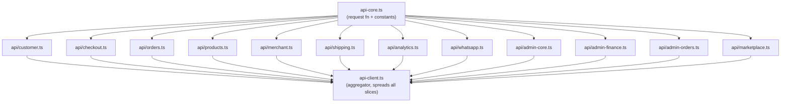

# Split `api-client.ts` into Domain Slices

## Strategy

- `src/lib/api-client.ts` stays the **single import target** — it exports `apiClient` composed from all slices via object spread. No caller changes needed.
- `src/lib/api-core.ts` — shared `request<T>()` function, constants, and `ApiMethod` type, imported by every slice.
- Domain slices live in `src/lib/api/` — each exports a plain object literal.




## New Files and Contents

- `**src/lib/api-core.ts**` — `ApiMethod`, constants, `isPublicMarketplaceGet`, `request<T>()`; exported as named exports
- `**src/lib/api/customer.ts**` — `getAuthContext`, profile, addresses, customer orders & reorder preview, `updateMyProfile` (~140 lines)
- `**src/lib/api/checkout.ts**` — `validateCoupon`, `checkoutPreview`, `checkoutSubmit`, `loyaltyPreview`, `loyaltyRedeem`, scoped coupons (`listScopedCoupons`, `upsertCoupon`, `deleteCoupon`) (~55 lines)
- `**src/lib/api/orders.ts**` — `getOrderById`, `getMyOrders`, `getOrderDetail`, `cancelOrder`, `updateOrderAgent/Status/Notes`, `getAgentsList`, `getAgentOrders`, `createManualOrder`, `listScopedOrders`, `listScopedCustomers`, `trackOrder` (~100 lines)
- `**src/lib/api/products.ts**` — `getProductById`, `createProduct`, `updateProduct`, `listScopedProducts`, `updateProductStatus`, `getCategoriesAdminList`, `uploadProductImage`, `getInventory`, `adjustInventory` (~130 lines)
- `**src/lib/api/merchant.ts**` — `registerMerchantApplication`, `getMyMerchantApplicationStatus`, `getMerchantSettings`, `upsertMerchantSettings`, `getMerchantDashboard`, import template/preview/confirm, bulk actions, quick-add, duplicate, `getMerchantProducts/Orders/DashboardStats/Readiness/PerformanceScorecard`, finance statement/summary/payout-history (~280 lines)
- `**src/lib/api/shipping.ts**` — `getDeliveryCompanies`, `createDeliveryCompany`, `updateDeliveryCompanyPolicy`, governorates, prices; agent delivery actions (`markOrderPickedUp/InTransit/DeliveryDelivered/DeliveryFailed`, `addOrderDeliveryNote`, `getOrderDeliveryEvents`) (~100 lines)
- `**src/lib/api/analytics.ts**` — event summary, experiments, experiment report, ingestion health, retention cleanup, reconciliation diagnostics/outbound attempts/dead-letters/replay/transition (~180 lines)
- `**src/lib/api/whatsapp.ts**` — `createWhatsAppIntent`, `markWhatsAppIntentOpened`, `getMerchantIntentMetrics`, `resolveWhatsAppIntent` (~60 lines)
- `**src/lib/api/admin-core.ts**` — analytics overview, governance tasks, commercial policy, executive governance, agents CRUD, loyalty settings, notifications, merchant plans/assignments, commercial rules, merchant CRUD (`getActiveMerchants` through `assignMerchantOwner`) (~250 lines)
- `**src/lib/api/admin-finance.ts**` — reconciliation orders, financial detail, merchant balances, courier payables, courier reconciliation orders, COD summary, merchant/courier ledger, manual adjustments, reversals, finance events, payout batches (merchant + courier) (~320 lines)
- `**src/lib/api/admin-orders.ts**` — order collection (`markAdminOrderCollected`), delivery admin ops (assign company/agent, picked-up, in-transit, delivered, failed, returned, note, events, ops list), remittance endpoints, courier settle/dispute/release, collection events (~150 lines)
- `**src/lib/api/marketplace.ts**` — all `/marketplace/*` and deprecated `/catalog/*` endpoints, `getStorefrontDefaultMerchant`, `getActiveMerchantBySlug` (~200 lines)

## Aggregator (`api-client.ts` after split)

```typescript
import { customerApi }      from "./api/customer";
import { checkoutApi }      from "./api/checkout";
// ... all 12 slices
import { adminOrdersApi }   from "./api/admin-orders";

export const apiClient = {
  ...customerApi,
  ...checkoutApi,
  ...ordersApi,
  ...productsApi,
  ...merchantApi,
  ...shippingApi,
  ...analyticsApi,
  ...whatsappApi,
  ...adminCoreApi,
  ...adminFinanceApi,
  ...adminOrdersApi,
  ...marketplaceApi,
  // Aliases resolved without self-reference:
  markOrderCashCollected:      adminOrdersApi.markAdminOrderCollected,
  markOrderRemittedToPlatform: adminOrdersApi.markAdminOrderRemittedToPlatform,
  markOrderRemittedToMerchant: adminOrdersApi.markAdminOrderRemittedToMerchant,
  settleOrderCourier:          adminOrdersApi.settleAdminOrderCourier,
  markOrderAsDisputed:         adminOrdersApi.markAdminOrderFinanceDispute,
};
```

## Key Constraints

- The 5 alias methods (lines 1143–1173) currently call `apiClient.xxx` — replace with direct references to their slice, eliminating the self-reference.
- `previewMerchantProductImport` uses raw `fetch` + manual token — keep this special case inside `merchant.ts`, importing `supabase` and `API_BASE_URL` from `api-core.ts`.
- Run `npm run build` after completing the split to confirm zero TypeScript errors.

