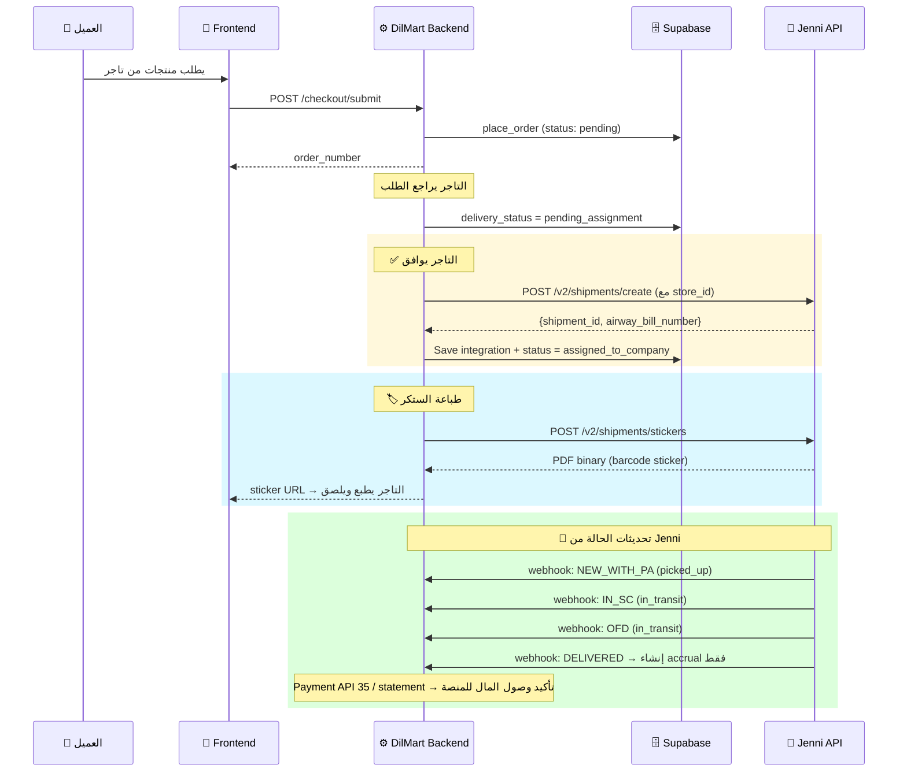
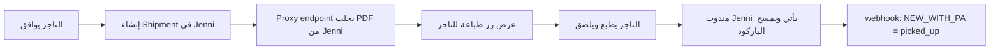
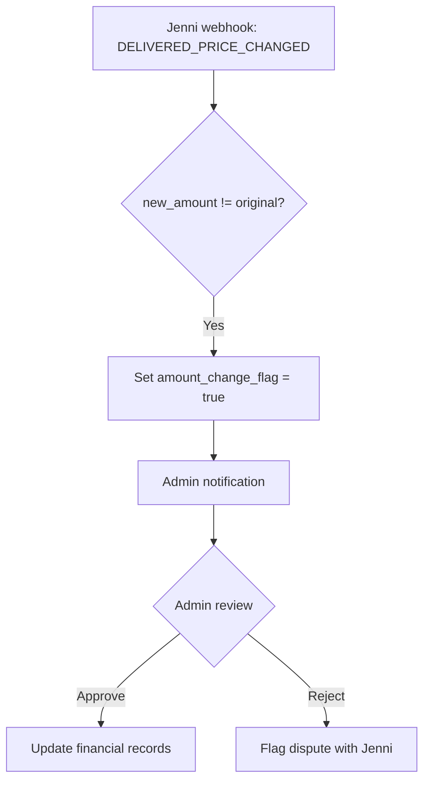

# 📋 JENNI INTEGRATION — FINAL CONTRACT

> **Version**: 3.0 (Post-Supervisor Review)  
> **Date**: 2026-06-15  
> **Status**: 🟡 REVISED — تم تعديل النموذج بناءً على مراجعة المشرف المعماري  
> **API Reference**: https://jenni.alzaeemexp.com/api/v2/docs

---

## 1. نموذج الأعمال (Business Model)

> [!IMPORTANT]
> **قرار معماري محسوم**: DilMart هي جهة التحاسب الوحيدة مع Jenni.
> لا توجد علاقة مالية مباشرة بين Jenni وأي تاجر.

### نموذج الهوية — يُحسم في Phase 0

**الخيار المفضّل (A) — Stores فقط:**

```
┌─────────────────────────────────────────────────────────────┐
│           DilMart = Main Merchant في Jenni                    │
│  ⤷ حساب واحد = جهة التحاسب الرئيسية                         │
│  ⤷ system_code واحد لكل الشحنات                              │
│                                                               │
│  ┌────────────┐  ┌────────────┐  ┌────────────┐              │
│  │  Store A   │  │  Store B   │  │  Store C   │              │
│  │ (تاجر 1)  │  │ (تاجر 2)  │  │ (تاجر 3)  │              │
│  └────────────┘  └────────────┘  └────────────┘              │
│  ← كلها Stores/Pickup Points تحت حساب DilMart مباشرة →       │
└─────────────────────────────────────────────────────────────┘
```

**الخيار البديل (B) — فقط إذا فرضته Jenni API تقنياً:**

```
┌─────────────────────────────────────────────────────────────┐
│               DilMart = Aggregator في Jenni                    │
│                                                               │
│  ┌──────────────┐  ┌──────────────┐  ┌──────────────┐        │
│  │ Merchant A   │  │ Merchant B   │  │ Merchant C   │        │
│  │ (تشغيلي فقط)│  │ (تشغيلي فقط)│  │ (تشغيلي فقط)│        │
│  │  Store 1     │  │  Store 2     │  │  Store 3     │        │
│  └──────────────┘  └──────────────┘  └──────────────┘        │
│  ⚠️ التحاسب المالي يبقى مع DilMart فقط — لا علاقة مالية     │
│     مباشرة بين Jenni وأي Merchant                            │
└─────────────────────────────────────────────────────────────┘
```

> [!WARNING]
> **لا يُعتمد أي نموذج قبل إتمام Phase 0 (اختبار API).**
> يجب اختبار: هل يمكن إنشاء Store بدون merchant_id أو بـ merchant_id الخاص بـ DilMart؟

### القواعد الأساسية (ثابتة في كلا الخيارين)

| #   | القاعدة                                  | التفصيل                                           |
| --- | ---------------------------------------- | ------------------------------------------------- |
| 1   | **DilMart = جهة التحاسب الوحيدة**        | Jenni تحاسب DilMart فقط — لا تحاسب أي تاجر مباشرة |
| 2   | **كل تاجر = نقطة استلام (Pickup Point)** | يمثّل Store/Pickup Point لتوجيه مندوب Jenni       |
| 3   | **كل طلب = تاجر واحد**                   | الطلب يحتوي منتجات من تاجر واحد فقط               |
| 4   | **Shipment = بعد موافقة التاجر**         | الشحنة تُنشأ في Jenni فقط بعد أن يوافق التاجر     |
| 5   | **store_id في الشحنة**                   | يُرسل مع الشحنة لتوجيه مندوب Jenni لموقع الاستلام |
| 6   | **التحاسب: Jenni → DilMart → التاجر**    | DilMart تستقبل وتوزع                              |

---

## 2. دورة حياة الطلب (Order Lifecycle)



---

## 3. Merchant & Store Management

> [!IMPORTANT]
> **هذا القسم يعتمد على نتيجة Phase 0.**
> الـ Payloads أدناه توضيحية — يتم تثبيت النموذج النهائي بعد اختبار API.

### الخيار A (المفضّل): Store مباشرة تحت DilMart

```json
// POST /v2/stores/create
// Authorization: Bearer {DilMart_token}
{
  "store_name": "اسم التاجر - نقطة الاستلام",
  "store_phone": "07XXXXXXXXX",
  "governorate_code": "BGD",
  "address": "العنوان التفصيلي",
  "latitude": 33.3152,
  "longitude": 44.3661
  // بدون merchant_id → ينتمي لحساب DilMart الرئيسي
}
```

**Response يحفظ**:

- `store_id` → حقل `jenni_store_id` في جدول stores المحلي

### الخيار B (البديل): Merchant تشغيلي + Store

**فقط إذا أثبت Phase 0 أن الخيار A لا يعمل.**

```json
// خطوة 1: POST /v2/merchant-management/create
{
  "merchant_name": "اسم التاجر",
  "phone": "07XXXXXXXXX",
  "system_code": "DilMart_MERCHANT_{merchant_uuid_short}"
}
// Response: merchant_id = 123

// خطوة 2: POST /v2/stores/create
{
  "store_name": "اسم التاجر - نقطة الاستلام",
  "store_phone": "07XXXXXXXXX",
  "governorate_code": "BGD",
  "address": "العنوان التفصيلي",
  "merchant_id": 123  // ربط بالتاجر التشغيلي
}
```

> ⚠️ **حتى في الخيار B**: Merchant يكون تشغيلي فقط.
> التحاسب المالي يبقى حصرياً بين Jenni و DilMart.

### قراءة المتاجر

```
GET /v2/merchants/my-stores?page=1&size=20
```

---

## 4. Shipment Payload — البنية النهائية

### 4.1 Create Shipment

```json
// POST /v2/shipments/create
// Authorization: Bearer {DilMart_token}
{
  "system_code": "DilMart_SYSTEM_CODE",
  "shipments": [
    {
      // === مُعرّفات ===
      "shipment_number": "ORD-2026-00123", // رقم الطلب المعروض
      "external_shipment_id": "uuid-of-order", // ✅ مطلوب: UUID الطلب الداخلي

      // === معلومات المستلم ===
      "receiver_name": "اسم العميل",
      "receiver_phone_1": "07901234567",
      "receiver_phone_2": "07801234567", // اختياري
      "governorate_code": "BGD",
      "city": "الكرادة",
      "address": "شارع المتنبي - عمارة 5",

      // === المالية ===
      "amount_iqd": 75000, // مبلغ COD بالدينار العراقي
      "amount_usd": 0,

      // === تفاصيل الشحنة ===
      "quantity": 3,
      "product_info": "شامبو x2, كريم x1",
      "note": "الرجاء الاتصال قبل التوصيل",
      "is_proof_of_delivery": true,
      "is_fragile": false,
      "have_return_item": false,
      "is_special_case": false,

      // === ⭐ الجديد: ربط المتجر ===
      "store_id": 101 // ✅ jenni_store_id الخاص بالتاجر
    }
  ]
}
```

### 4.2 Response يُحفظ

```json
{
  "accepted_shipments": [
    {
      "shipment_number": "ORD-2026-00123",
      "shipment_id": 56789, // ← يُحفظ كـ provider_shipment_id
      "airway_bill_number": "AWB001" // ← يُحفظ
    }
  ]
}
```

---

## 5. Sticker / Barcode Flow

### 5.1 طلب الستكر

```bash
# POST /v2/shipments/stickers
# Authorization: Bearer {DilMart_token}
# Content-Type: application/json
# Response: binary PDF

{
  "shipment_numbers": ["ORD-2026-00123"],
  "width_mm": 100,
  "height_mm": 150
}
```

### 5.2 Flow كامل



### 5.3 استراتيجية التخزين

| المرحلة                | الآلية                                  | الملاحظة                             |
| ---------------------- | --------------------------------------- | ------------------------------------ |
| **المرحلة 1**          | Proxy endpoint يمرر PDF من Jenni مباشرة | أبسط — لا تخزين                      |
| **المرحلة 2** (لاحقاً) | تخزين في Supabase Storage               | إذا احتجنا caching أو offline access |

---

## 6. Status Mapping — الخريطة النهائية

> [!IMPORTANT]
> **قرار المشرف**: لا توسيع لـ delivery_status في المرحلة الأولى.
> نستخدم الحالات الـ 9 الحالية، ونحفظ تفاصيل Jenni في `provider_current_step` و `delivery_events`.

### 6.1 Webhook → Internal Status (Minimal Mapping)

| Jenni Step/Action         | Internal `delivery_status` | `provider_current_step`   | ملاحظات                                    |
| ------------------------- | -------------------------- | ------------------------- | ------------------------------------------ |
| `NEW_ORDER_TO_PRINT`      | `assigned_to_company`      | `NEW_ORDER_TO_PRINT`      | الطلب في نظام Jenni                        |
| `NEW_ORDER_TO_PICKUP`     | `assigned_to_company`      | `NEW_ORDER_TO_PICKUP`     | بانتظار الاستلام                           |
| `NEW_WITH_PA`             | `picked_up`                | `NEW_WITH_PA`             | ✅ **أول Scan** — مندوب مسح الباركود       |
| `IN_SC`                   | `in_transit`               | `IN_SC`                   | دخل مركز الفرز (التفصيل في event metadata) |
| `PRINT_MANIFEST_DA`       | `in_transit`               | `PRINT_MANIFEST_DA`       | طباعة المنفيست                             |
| `OFD`                     | `in_transit`               | `OFD`                     | خرج للتوصيل                                |
| `DELIVERED`               | `delivered`                | `DELIVERED`               | ✅ تسليم ناجح → إنشاء accrual              |
| `SUCCESSFUL_DELIVERY`     | `delivered`                | `SUCCESSFUL_DELIVERY`     | ✅ تسليم ناجح                              |
| `DELIVERED_PRICE_CHANGED` | `delivered`                | `DELIVERED_PRICE_CHANGED` | ⚠️ تغيير مبلغ → `amount_change_flag`       |
| `PARTIALLY_DELIVERED`     | `in_transit`               | `PARTIALLY_DELIVERED`     | ⚠️ تسليم جزئي → event + admin review       |
| `POSTPONED`               | `in_transit`               | `POSTPONED`               | مؤجل → event metadata: reason + date       |
| `POSTPONED_CONFIRMED`     | `in_transit`               | `POSTPONED_CONFIRMED`     | تأكيد التأجيل                              |
| `DELIVERY_REATTEMPT`      | `in_transit`               | `DELIVERY_REATTEMPT`      | إعادة محاولة                               |
| `RTO_CONFIRMED`           | `returned`                 | `RTO_CONFIRMED`           | تأكيد الإرجاع                              |
| `RTO_WITH_DA`             | `returned`                 | `RTO_WITH_DA`             | مرتجع مع المندوب                           |
| `RTO_WH`                  | `returned`                 | `RTO_WH`                  | مرتجع في المستودع                          |
| `RTO_ARCHIVED`            | `returned`                 | `RTO_ARCHIVED`            | مرتجع أُرشف                                |
| `RETURNED_WITH_AGENT`     | `returned`                 | `RETURNED_WITH_AGENT`     | مع المندوب                                 |
| `RETURN_APPROVED`         | `returned`                 | `RETURN_APPROVED`         | تمت الموافقة                               |
| `FORCE_DELIVERY`          | `in_transit`               | `FORCE_DELIVERY`          | توصيل إجباري                               |

### 6.2 Internal Delivery Status — State Machine (بدون تغيير)

```
الحالات الـ 9 الحالية لا تتغير:
pending_assignment → assigned_to_company → assigned_to_agent → picked_up
  → in_transit → delivered
              → failed → returned
              → returned
  → cancelled
```

### 6.3 أين نحفظ التفاصيل الإضافية؟

| المعلومة                                  | أين تُحفظ                                              |
| ----------------------------------------- | ------------------------------------------------------ |
| حالة Jenni الدقيقة (`IN_SC`, `OFD`, etc.) | `order_delivery_integrations.provider_current_step`    |
| الترجمة العربية                           | `order_delivery_integrations.provider_current_step_ar` |
| سبب التأجيل / الإرجاع                     | `delivery_events.metadata` (JSON)                      |
| تاريخ التأجيل                             | `delivery_events.metadata.postponed_date`              |
| سبب الإرجاع                               | `delivery_events.metadata.return_reason`               |

---

## 7. Cancel Shipment

### 7.1 متى يمكن الإلغاء؟

| الحالة                               | قابل للإلغاء؟ | الطريقة                           |
| ------------------------------------ | ------------- | --------------------------------- |
| قبل الإرسال لـ Jenni                 | ✅ نعم        | إلغاء محلي فقط                    |
| `assigned_to_company` (قبل الاستلام) | ✅ نعم        | `DELETE /v2/orders/{shipment_id}` |
| `picked_up` وما بعدها                | ❌ لا         | يجب طلب Return عبر Jenni          |

### 7.2 Payload

```bash
DELETE https://jenni.alzaeemexp.com/api/v2/orders/{shipment_id}
Authorization: Bearer {token}
```

### 7.3 بعد الإلغاء

1. تحديث `order_delivery_integrations.dispatch_status = 'cancelled'`
2. تحديث `orders.delivery_status = 'cancelled'`
3. إعادة المخزون (إذا لزم)
4. إلغاء أي حسابات مالية معلقة

---

## 8. Modify COD (تعديل مبلغ الدفع عند الاستلام)

### 8.1 من جهة DilMart (تعديل قبل التوصيل)

```json
// PUT /v2/shipments/edit
{
  "shipment_id": 56789,
  "amount_iqd": 60000 // المبلغ الجديد
}
```

> ⚠️ **ملاحظة**: التعديل ممكن فقط في المراحل الأولى. بعد خروج الشحنة للتوصيل، يتطلب موافقة.

### 8.2 من جهة Jenni (تغيير أثناء التوصيل)

عندما يُسلّم المندوب بمبلغ مختلف:

- Jenni ترسل `DELIVERED_PRICE_CHANGED` مع `new_amount_iqd`
- نظامنا يُعلّم الطلب بـ `amount_change_flag = true`
- الأدمن يراجع ويوافق أو يرفض

### 8.3 Flow



---

## 9. Settlement — التحاسب المالي

> [!WARNING]
> **DELIVERED ≠ وصول المال.** يجب التفريق بين الأحداث المالية.

### 9.1 نموذج التحاسب

```
┌────────────────────────────────────────────────────────┐
│                    Jenni تجمع COD                       │
│                                                        │
│  COD المجموع = مبلغ الطلب                              │
│  أجرة التوصيل = يُخصم من COD                           │
│  المبلغ المُحوّل = COD - أجرة التوصيل                  │
│                                                        │
│  Jenni ──────────→ DilMart (المبلغ المُحوّل)            │
│  DilMart ─────────→ التاجر (المبلغ - عمولة DilMart)     │
│                                                        │
│  ⚠️ لا يوجد تحاسب مباشر بين Jenni والتاجر             │
└────────────────────────────────────────────────────────┘
```

### 9.2 الأحداث المالية (مفصولة)

| الحدث                            | الأثر المالي                           | الحالة                 |
| -------------------------------- | -------------------------------------- | ---------------------- |
| `DELIVERED` webhook              | إنشاء **accrual** (إثبات الطلب كمكتمل) | `accrued`              |
| Jenni Payment Statement (API 35) | تأكيد أن **المال وصل المنصة**          | `remitted_to_platform` |
| بعد وصول المال                   | تحويل التاجر إلى **payable**           | `payable_to_merchant`  |
| دفع فعلي للتاجر                  | **تم الدفع**                           | `paid`                 |

> [!CAUTION]
> **لا تجعل `DELIVERED` وحده يعني `remitted_to_platform`.**
> التاجر يصبح مستحقاً فقط بعد تأكيد وصول المال من Jenni.

### 9.3 بيانات التسوية من Jenni API

**حقول Query Response ذات الصلة:**

- `merchant_settlement_id` — رقم دفعة التسوية (0 = لم يُسوّى)
- `merchant_settlement_date` — تاريخ التسوية
- `shipment_cost` — أجرة التوصيل

### 9.4 خطة بناء نظام التسوية

| المرحلة       | الهدف                       | التفاصيل                                                                           |
| ------------- | --------------------------- | ---------------------------------------------------------------------------------- |
| **المرحلة 1** | حفظ بيانات التسوية الخام    | عند query sync، نحفظ `merchant_settlement_id` و `shipment_cost` في integration row |
| **المرحلة 2** | اختبار Payment API (API 35) | endpoint تجريبي → fetch statement → حفظ raw response                               |
| **المرحلة 3** | بناء Reconciliation         | بعد فهم شكل response الحقيقي، نبني المطابقة                                        |

> ⚠️ **لا يُبنى `jenni-settlement.service.ts` كامل قبل اختبار API 35 الفعلي.**

### 9.5 التسوية مع التاجر

```
مبلغ التاجر = COD المجموع - أجرة التوصيل - عمولة DilMart
(يصبح payable فقط بعد تأكيد وصول المال من Jenni)
```

---

## 10. Webhook Contract — عقد الاستقبال

### 10.1 Endpoint

```
POST {DilMart_DOMAIN}/api/v2/push/update-status
POST {DilMart_DOMAIN}/v2/push/update-status          (alias)
Authorization: Bearer {JENNI_WEBHOOK_TOKEN}
Content-Type: application/json
```

### 10.2 Payload المتوقع من Jenni

```json
{
  "system_code": "DilMart_SYSTEM_CODE",
  "updates": [
    {
      "shipment_id": 56789,
      "external_shipment_id": "uuid-of-order",
      "action_code": "SUCCESSFUL_DELIVERY",
      "timestamp": "2026-06-15T14:30:00Z",
      // حقول إضافية حسب الحالة:
      "new_amount_iqd": 60000, // إذا DELIVERED_PRICE_CHANGED
      "return_reason": "الزبون رفض الطلب", // إذا RETURN
      "postponed_reason": "الزبون مشغول", // إذا POSTPONED
      "postponed_date_id": 1, // 1=غداً, 2=بعد يومين, 3=بعد 3 أيام
      "image_url": "https://...", // صورة إثبات التوصيل
      "note": "ملاحظة المندوب"
    }
  ]
}
```

### 10.3 Response المطلوب

```json
{
  "success": true,
  "message": "1 update(s) processed successfully",
  "results": [
    {
      "shipment_id": 56789,
      "status": "processed"
    }
  ]
}
```

---

## 11. Error Handling

### 11.1 إعادة المحاولة (Retry Strategy)

| السيناريو                 | الاستراتيجية                                          |
| ------------------------- | ----------------------------------------------------- |
| Jenni API timeout         | إعادة 3 مرات مع exponential backoff (1s, 2s, 4s)      |
| Token expired (401)       | تجديد تلقائي + إعادة الطلب                            |
| Rate limit (429)          | انتظار `Retry-After` header                           |
| Jenni rejected shipment   | حفظ في `dispatch_status = 'rejected'` + سبب الرفض     |
| Webhook processing failed | الرد بـ 200 OK + حفظ للمعالجة اللاحقة                 |
| `local_update_failed`     | يسمح بإعادة المحاولة من الواجهة بدون إنشاء شحنة مكررة |

### 11.2 أكواد الخطأ من Jenni

| Error Code             | المعنى          | الإجراء                               |
| ---------------------- | --------------- | ------------------------------------- |
| `DUPLICATE_SHIPMENT`   | شحنة مكررة      | تحقق من `order_delivery_integrations` |
| `INVALID_PHONE_NUMBER` | رقم هاتف خاطئ   | عرض للأدمن لتصحيحه                    |
| `INVALID_GOVERNORATE`  | كود محافظة خاطئ | مزامنة المحافظات                      |
| `PROCESSING_ERROR`     | خطأ عام         | إعادة المحاولة أو تصعيد               |

---

## 12. أمثلة Payload كاملة

### 12.1 إنشاء Store + Shipment + Sticker (الخيار A)

```
1. POST /v2/stores/create             → store_id = 200
2. POST /v2/shipments/create          → shipment_id = 300
3. POST /v2/shipments/stickers        → PDF binary (proxy)
```

### 12.1b إنشاء Merchant + Store + Shipment + Sticker (الخيار B — إذا لزم)

```
1. POST /v2/merchant-management/create → merchant_id = 100
2. POST /v2/stores/create             → store_id = 200
3. POST /v2/shipments/create          → shipment_id = 300
4. POST /v2/shipments/stickers        → PDF binary (proxy)
```

### 12.2 إلغاء شحنة

```
DELETE /v2/orders/300
```

### 12.3 تعديل COD

```
PUT /v2/shipments/edit { "shipment_id": 300, "amount_iqd": 45000 }
```
