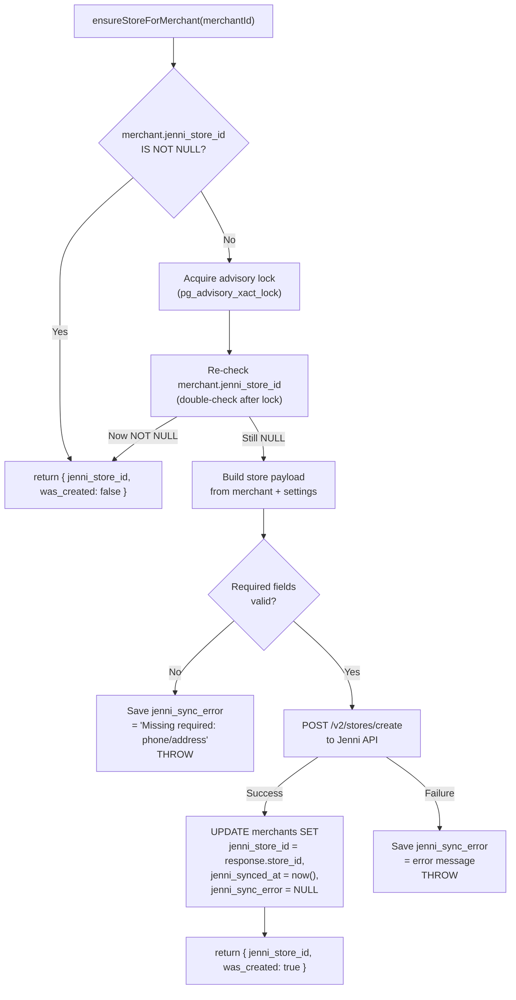

# 📐 JENNI PHASE 2 — Store Provisioning Plan

> **Security Note**: Sensitive credential values were redacted. Use environment variables from secure deployment dashboards instead.

> **Date**: 2026-06-16  
> **Updated**: 2026-06-16 10:34 (تصحيحات المشرف: UNIQUE INDEX + governorate matching)  
> **المسار المعتمد**: Path A — Stores-only  
> **الحالة**: 📋 **PLAN ONLY — SUPERVISOR DECISIONS LOCKED** — لا تنفيذ بدون أمر صريح  
> **يعتمد على**: Phase 1 Migration (COMPLETED ✅)

> [!CAUTION]
> هذا المستند **خطة فقط**. ممنوع تنفيذ أي كود أو provisioning أو dispatch أو إنشاء Store فعلي قبل موافقة صريحة.

---

## 1. الهدف

إنشاء خدمة `JenniStoreProvisioningService` تربط كل تاجر DilMart بـ Jenni Store:

```text
التاجر → ensureStoreForMerchant(merchantId) → Jenni Store
         ↓
         merchants.jenni_store_id = store_id من Jenni
```

---

## 2. الحالة الحالية بعد Phase 1

| التاجر                            | `jenni_store_id` | `merchant_settings`                                                  |
| --------------------------------- | ---------------- | -------------------------------------------------------------------- |
| `DilMart-primary` (DilMart Store) | `NULL`           | phone: `+964 787 185 7930`, city: `Baghdad`, address: `null`         |
| `alarsh` (شركة العرش)             | `NULL`           | phone: `0780123134`, city: `بغداد`, address: `المنصور شارع 14 رمضان` |

### Jenni Store موجود (Phase 0A reference فقط)

| store_id | اسم          | هاتف                      | الاستخدام                                           |
| -------- | ------------ | ------------------------- | --------------------------------------------------- |
| `17025`  | Stylia store | <REDACTED_JENNI_USERNAME> | ⚠️ **reference فقط** — لا يُستخدم تلقائياً في الكود |

> [!IMPORTANT]
> `store_id=17025` هو نتيجة Phase 0A فقط. **لا يُستخدم كقيمة ثابتة في الكود أبداً**.
> أي ربط يدوي يتم فقط عبر `linkExistingStore` من Admin بموافقة منفصلة.

---

## 3. تصميم الخدمة: `JenniStoreProvisioningService`

### 3.1 الملف المقترح

```text
backend/src/modules/jenni/jenni-store-provisioning.service.ts
```

### 3.2 الواجهة العامة

```typescript
@Injectable()
export class JenniStoreProvisioningService {
  /**
   * يضمن وجود Jenni Store لهذا التاجر.
   * - إذا merchant.jenni_store_id موجود → يرجع مباشرة
   * - إذا غير موجود → ينشئ Store في Jenni → يحفظ jenni_store_id
   * - يسجل jenni_sync_error عند الفشل
   * - لا ينشئ Store مكرر لنفس التاجر (idempotent)
   */
  async ensureStoreForMerchant(merchantId: string): Promise<{
    jenni_store_id: number;
    was_created: boolean;
  }>;

  /**
   * يحدّث jenni_store_id يدوياً (للربط مع store موجود مثل 17025).
   * يتطلب موافقة admin.
   */
  async linkExistingStore(
    merchantId: string,
    jenniStoreId: number,
  ): Promise<void>;

  /**
   * يجلب حالة ربط Jenni لتاجر معيّن.
   */
  async getProvisioningStatus(merchantId: string): Promise<{
    merchant_slug: string;
    jenni_store_id: number | null;
    jenni_synced_at: string | null;
    jenni_sync_error: string | null;
    is_linked: boolean;
  }>;
}
```

### 3.3 التدفق الداخلي: `ensureStoreForMerchant`



---

## 4. Source of Truth لبيانات Store

> [!IMPORTANT]
> **قرار المشرف**: لا تستخدم fallback للعنوان (`address = city` غير كافٍ للتوصيل الحقيقي).
> إذا البيانات ناقصة: لا تستدعي Jenni API، احفظ `jenni_sync_error` برسالة واضحة.

### 4.1 تعيين الحقول

| حقل Jenni API      | المصدر المحلي                                                      | Fallback                           | إذا فارغ                     |
| ------------------ | ------------------------------------------------------------------ | ---------------------------------- | ---------------------------- |
| `store_name`       | `merchants.display_name`                                           | لا                                 | ❌ **خطأ** — لا provisioning |
| `store_phone`      | `merchant_settings.contact_phone`                                  | `merchant_settings.whatsapp_phone` | ❌ **خطأ** — لا provisioning |
| `governorate_code` | `governorates.jenni_governorate_code` عبر `merchant_settings.city` | لا                                 | ❌ **خطأ** — لا provisioning |
| `address`          | `merchant_settings.address` فقط                                    | لا (لا `city` كبديل)               | ❌ **خطأ** — لا provisioning |
| `latitude`         | لا يوجد حالياً                                                     | `null`                             | ✅ اختياري                   |
| `longitude`        | لا يوجد حالياً                                                     | `null`                             | ✅ اختياري                   |

### 4.2 Payload Builder

```typescript
private async buildStorePayload(merchant: Merchant, settings: MerchantSettings): Promise<JenniStoreCreatePayload> {
  // Strict validation — no fallbacks for address
  const errors: string[] = [];

  if (!merchant.display_name) errors.push('display_name');

  const phone = normalizeIraqMobilePhone(
    settings.contact_phone || settings.whatsapp_phone || ''
  );
  if (!phone) errors.push('phone');

  if (!settings.address) errors.push('address');

  const govCode = await this.resolveGovernorateCode(settings.city);
  if (!govCode) errors.push('city/governorate mapping');

  if (errors.length > 0) {
    const msg = `Cannot provision Jenni Store: missing ${errors.join(', ')}`;
    await this.saveSyncError(merchant.id, msg);
    throw new BadRequestException(msg);
  }

  return {
    store_name: merchant.display_name,
    store_phone: phone!,
    governorate_code: govCode!,
    address: settings.address!,
    // merchant_id: omitted — Path A (stores-only, no sub-merchants)
  };
}
```

### 4.3 تعيين Governorate Code

> [!WARNING]
> **تصحيح المشرف**: لا نستخدم `ilike('%city%')` — fuzzy matching خطر بسبب اختلاف العربية/الإنجليزية وتطابقات جزئية.
> المطلوب: **normalized exact matching** مع aliases معروفة.

**الطريقة المعتمدة:**

```typescript
/**
 * Resolve city name to Jenni governorate code using normalized exact matching.
 * NO fuzzy ilike. If no exact match found → error, no provisioning.
 */
private async resolveGovernorateCode(city: string | null): Promise<string | null> {
  if (!city) return null;

  const normalized = this.normalizeGovernorateInput(city);

  // 1. Try exact match on governorates.name (normalized)
  const { data: exactMatch } = await this.supabaseAdmin.client
    .from('governorates')
    .select('jenni_governorate_code')
    .eq('name', city)
    .maybeSingle();
  if (exactMatch?.jenni_governorate_code) return exactMatch.jenni_governorate_code;

  // 2. Try known aliases mapping
  const aliasCode = GOVERNORATE_ALIASES[normalized];
  if (aliasCode) return aliasCode;

  // 3. No match → return null → caller throws error
  return null;
}

private normalizeGovernorateInput(input: string): string {
  return input
    .trim()
    .toLowerCase()
    .replace(/[\u064B-\u065F\u0670]/g, '')  // remove Arabic diacritics
    .replace(/\s+/g, ' ');
}
```

**جدول Aliases المعروفة:**

```typescript
/** Known aliases for Iraqi governorate names (Arabic/English variations) */
const GOVERNORATE_ALIASES: Record<string, string> = {
  // Baghdad
  baghdad: "BGD",
  بغداد: "BGD",
  "بغداد الرصافة": "BGD",
  "بغداد الكرخ": "BGD",
  // Basra
  basra: "BSR",
  البصرة: "BSR",
  بصرة: "BSR",
  // Erbil
  erbil: "EBL",
  arbil: "EBL",
  اربيل: "EBL",
  أربيل: "EBL",
  // ... remaining 16 governorates filled from governorates table
};
```

> [!NOTE]
> جدول Aliases يُملأ عند التنفيذ من جدول `governorates` الحالي (19 محافظة).
> إذا لم يوجد match دقيق → error + `jenni_sync_error` + لا provisioning.

### 4.4 Validation Rules (صارمة — لا fallbacks)

| الحقل                       | الحالة    | السلوك                                               |
| --------------------------- | --------- | ---------------------------------------------------- |
| `display_name`              | فارغ      | ❌ **خطأ** — احفظ `jenni_sync_error` + أظهر في Admin |
| `contact_phone`             | فارغ      | استخدم `whatsapp_phone`                              |
| كلا الهاتفين                | فارغ      | ❌ **خطأ** — احفظ `jenni_sync_error`                 |
| `address`                   | فارغ      | ❌ **خطأ** — **لا** تستخدم `city` كبديل              |
| `city` → `governorate_code` | لم يُطابق | ❌ **خطأ** — **لا** تستخدم `BGD` كافتراضي            |

> [!NOTE]
> السبب: `address = city` غير كافٍ للتوصيل الحقيقي. و`BGD` كافتراضي قد يرسل شحنات لمحافظة خاطئة.

---

## 5. قواعد خاصة بالتجار (قرارات المشرف ✅)

### 5.1 `DilMart-primary` (DilMart Store)

| البند                   | القرار                                                   |
| ----------------------- | -------------------------------------------------------- |
| Provisioning الآن       | ❌ **لا** — يبقى `jenni_store_id = NULL`                 |
| ربط بـ `store_id=17025` | ❌ **لا تلقائياً** — يمكن يدوياً من Admin بموافقة منفصلة |
| العنوان                 | `null` حالياً — **يجب تحديثه قبل** أي provisioning       |
| `17025` في الكود        | ❌ **ممنوع** — reference فقط من Phase 0A                 |

### 5.2 `alarsh` (شركة العرش)

| البند    | القرار                                                            |
| -------- | ----------------------------------------------------------------- |
| الحاجة   | يحتاج **Jenni Store مستقل** خاص به                                |
| الهاتف   | `0780123134` — صالح ✅                                            |
| العنوان  | `المنصور شارع 14 رمضان` — صالح ✅                                 |
| المحافظة | `بغداد` → `BGD` ✅                                                |
| التوقيت  | **ليس الآن** — يتم إنشاؤه لاحقاً إما من Admin أو عند أول dispatch |
| `17025`  | ❌ **لا يُربط أبداً** بـ `17025`                                  |

### 5.3 القواعد العامة (قرارات مشرف مؤكدة)

```text
❌ لا يُستخدم store_id=17025 تلقائياً في الكود أبداً
❌ لا يُربط أي merchant بـ store_id ثابت في الكود
❌ لا provisioning إذا phone/address/city/display_name ناقصة
✅ كل ربط يتم عبر ensureStoreForMerchant أو linkExistingStore
✅ linkExistingStore يتطلب admin action صريح
✅ إذا البيانات ناقصة: احفظ jenni_sync_error + أظهر في Admin UI
```

---

## 6. Idempotency & Concurrency

### 6.1 المشكلة

ماذا يحدث لو طلبان لنفس التاجر حاولا `ensureStoreForMerchant` بنفس الوقت؟

```text
Request A: checks jenni_store_id → NULL
Request B: checks jenni_store_id → NULL
Request A: POST /v2/stores/create → store_id = 500
Request B: POST /v2/stores/create → store_id = 501  ← مشكلة! Store مكرر
```

### 6.2 الحل: PostgreSQL Advisory Lock

```typescript
async ensureStoreForMerchant(merchantId: string) {
  // 1. Quick check without lock
  const merchant = await this.getMerchantWithJenniFields(merchantId);
  if (merchant.jenni_store_id) {
    return { jenni_store_id: merchant.jenni_store_id, was_created: false };
  }

  // 2. Acquire advisory lock (hash of merchantId)
  const lockKey = this.hashMerchantIdForLock(merchantId);

  const { data: result } = await this.supabaseAdmin.client.rpc(
    'jenni_ensure_store_lock',  // DB function
    { p_merchant_id: merchantId, p_lock_key: lockKey }
  );

  // 3. Re-check after lock (double-check pattern)
  const refreshed = await this.getMerchantWithJenniFields(merchantId);
  if (refreshed.jenni_store_id) {
    return { jenni_store_id: refreshed.jenni_store_id, was_created: false };
  }

  // 4. Now safe to create
  const payload = await this.buildStorePayload(refreshed, ...);
  const response = await this.jenniClient.post<JenniStoreCreateResponse>(
    '/v2/stores/create', payload
  );

  const storeId = response.store_id || response.id;
  if (!storeId) throw new Error('Jenni API returned no store_id');

  // 5. Save result
  await this.saveMerchantStoreId(merchantId, storeId);

  return { jenni_store_id: storeId, was_created: true };
}
```

### 6.3 استراتيجية الحماية المعتمدة (تصحيح المشرف ✅)

**الاستراتيجية الحالية:**

```text
Advisory Lock + double-check + DB index protection
```

- Advisory Lock يمنع إنشاء Store مكرر **في Jenni**
- DB index على `jenni_store_id` يساعد في البحث السريع
- double-check قبل وبعد Lock يتجنب race conditions

> [!NOTE]
> **Optional future hardening:**
> Partial UNIQUE index on `merchants(jenni_store_id) WHERE jenni_store_id IS NOT NULL`
> بعد التأكد أنه لا توجد حاجة تشغيلية لربط أكثر من merchant بنفس Jenni Store.
> بعض الأنظمة قد تسمح نظرياً بربط أكثر من فرع أو merchant بنفس Store لأسباب تشغيلية.

### 6.4 ملخص الأمان

| السيناريو                   | الحماية                                                    |
| --------------------------- | ---------------------------------------------------------- |
| طلبان متزامنان لنفس التاجر  | Advisory Lock → الثاني ينتظر                               |
| Re-check قبل Jenni API      | يتجنب إنشاء Store مكرر                                     |
| Re-check بعد Lock           | double-check — حماية إضافية                                |
| DB index على jenni_store_id | بحث سريع + يمكن ترقيته لـ UNIQUE لاحقاً                    |
| Jenni API failure           | يُسجَّل في `jenni_sync_error`، لا يُحدَّث `jenni_store_id` |

---

## 7. Admin UI المطلوب (قرار المشرف: يدخل في Phase 2 ✅)

> [!NOTE]
> Admin UI محدود فقط لـ **Store Provisioning**.
> لا dispatch، لا shipment، لا finance، لا credentials.

### 7.1 عرض حالة Jenni لكل تاجر

| العنصر                    | التفصيل                                     |
| ------------------------- | ------------------------------------------- |
| **`jenni_store_id`**      | عرض الرقم أو "غير مربوط"                    |
| **حالة الربط**            | badge: 🟢 Linked / 🔴 Not Linked / 🟡 Error |
| **`jenni_synced_at`**     | تاريخ آخر مزامنة ناجحة                      |
| **`jenni_sync_error`**    | عرض آخر خطأ (إن وجد) بلون أحمر              |
| **❌ لا عرض credentials** | لا كلمة مرور، لا token، لا API key          |

### 7.2 أزرار Action

| الزر                       | الوظيفة                              | الشروط                           |
| -------------------------- | ------------------------------------ | -------------------------------- |
| **🔗 Create / Sync Store** | يستدعي `ensureStoreForMerchant`      | فقط إذا `jenni_store_id = NULL`  |
| **🔗 Link Existing Store** | يفتح dialog لإدخال `store_id` يدوياً | admin only                       |
| **🔄 Refresh Status**      | يجلب حالة Store من Jenni API         | فقط إذا `jenni_store_id != NULL` |
| **❌ لا زر Unlink/Delete** | حذف الربط يتطلب SQL مباشر            | حماية من الحذف العرضي            |
| **❌ لا زر Dispatch**      | Phase 3                              | ممنوع                            |
| **❌ لا زر Shipment**      | Phase 3                              | ممنوع                            |

### 7.3 موقع في UI

```text
Admin Dashboard → Merchants → [Merchant Detail] → Jenni Integration Tab
```

وضمن قائمة التجار كعمود إضافي:

```text
| اسم التاجر | الحالة | Jenni Store | آخر مزامنة |
|------------|--------|------------|------------|
| DilMart Store | active | 🔴 Not Linked | — |
| شركة العرش | active | 🔴 Not Linked | — |
```

---

## 8. الاختبارات المطلوبة

### 8.1 Unit Tests

| الاختبار                                        | الوصف                                                           |
| ----------------------------------------------- | --------------------------------------------------------------- |
| `merchant_with_existing_jenni_store_id`         | يرجع مباشرة بدون API call                                       |
| `merchant_without_jenni_store_id_creates_store` | يستدعي Jenni API ويحفظ `store_id`                               |
| `jenni_api_failure_saves_sync_error`            | يسجل الخطأ ولا يُحدّث `jenni_store_id`                          |
| `duplicate_prevention_with_lock`                | طلبان متزامنان → store واحد فقط                                 |
| `missing_phone_throws_validation_error`         | لا ينشئ Store بدون هاتف صالح                                    |
| `missing_display_name_throws_error`             | لا ينشئ Store بدون اسم                                          |
| `fallback_to_whatsapp_phone`                    | يستخدم `whatsapp_phone` إذا `contact_phone` فارغ                |
| `missing_address_strict_error`                  | لا provisioning بدون address (لا fallback لـ city)              |
| `missing_governorate_strict_error`              | لا provisioning إذا city لم تُطابق governorate (لا BGD افتراضي) |
| `governorate_code_resolution`                   | يطابق `بغداد` → `BGD`                                           |
| `link_existing_store_saves_id`                  | `linkExistingStore` يحفظ store_id بدون API call                 |
| `link_existing_store_rejects_duplicate`         | لا يسمح بربط store_id مربوط بتاجر آخر                           |
| `sync_error_saved_on_missing_data`              | يحفظ `jenni_sync_error` برسالة واضحة عند نقص البيانات           |

---

## 9. JenniClientService — Methods المطلوبة

### 9.1 Methods جديدة

```typescript
// إضافة إلى jenni-client.service.ts

/** إنشاء Store جديد في Jenni */
async createStore(payload: JenniStoreCreatePayload): Promise<JenniStoreCreateResponse> {
  return this.post<JenniStoreCreateResponse>('/v2/stores/create', payload);
}

/** جلب Stores الحالية للحساب */
async listStores(page = 1, size = 50): Promise<{ data: JenniStoreInfo[] }> {
  return this.get('/v2/merchants/my-stores', { page: String(page), size: String(size) });
}

/** جلب تفاصيل Store بالـ store_id */
async getStore(storeId: number): Promise<JenniStoreInfo | null> {
  const result = await this.listStores(1, 100);
  return result.data?.find(s => s.store_id === storeId || s.id === storeId) || null;
}
```

### 9.2 Types المطلوبة

```typescript
// إضافة إلى jenni.types.ts

export type JenniStoreInfo = {
  store_id?: number;
  id?: number;
  store_name?: string;
  store_phone?: string;
  governorate_code?: string;
  address?: string;
  latitude?: number;
  longitude?: number;
  [key: string]: unknown;
};
```

---

## 10. JenniModule — تسجيل الخدمة

```typescript
// jenni.module.ts — إضافة
providers: [
  // ... existing
  JenniStoreProvisioningService,
],
exports: [
  // ... existing
  JenniStoreProvisioningService,
],
```

---

## 11. ممنوعات Phase 2

| ممنوع                                        | السبب                       |
| -------------------------------------------- | --------------------------- |
| ❌ dispatch                                  | Phase 3                     |
| ❌ shipment creation                         | Phase 3                     |
| ❌ finance/settlement                        | Phase 5+                    |
| ❌ webhook changes                           | لا حاجة                     |
| ❌ استخدام تلقائي لـ `store_id=17025`        | ممنوع دائماً في الكود       |
| ❌ تعديل `place_order()`                     | لا حاجة                     |
| ❌ تعديل delivery_status                     | لا حاجة                     |
| ❌ secrets في Git                            | ممنوع دائماً                |
| ❌ إنشاء Store فعلي قبل موافقة تنفيذ Phase 2 | الخطة فقط                   |
| ❌ fallback `address = city`                 | غير كافٍ للتوصيل الحقيقي    |
| ❌ fallback `governorate = BGD`              | قد يرسل شحنات لمحافظة خاطئة |

---

## 12. ملخص الملفات المتوقعة

| الملف                                          | النوع      | الوصف                             |
| ---------------------------------------------- | ---------- | --------------------------------- |
| `jenni-store-provisioning.service.ts`          | **NEW**    | الخدمة الرئيسية                   |
| `jenni-client.service.ts`                      | **MODIFY** | إضافة `createStore`, `listStores` |
| `jenni.types.ts`                               | **MODIFY** | إضافة `JenniStoreInfo` type       |
| `jenni.module.ts`                              | **MODIFY** | تسجيل الخدمة الجديدة              |
| ربما: migration لـ `pg_advisory_lock` function | **NEW**    | إذا اعتمدنا DB-level lock         |
| اختبارات                                       | **NEW**    | unit + integration tests          |

---

## 13. قرارات المشرف النهائية ✅

| #   | القرار                           | الحكم                                                                          |
| --- | -------------------------------- | ------------------------------------------------------------------------------ |
| 1   | `DilMart-primary` provisioning   | ❌ **لا الآن** — يبقى NULL                                                     |
| 2   | ربط `DilMart-primary` بـ `17025` | ❌ **لا تلقائياً** — يدوياً من Admin بموافقة منفصلة                            |
| 3   | `alarsh` provisioning            | ❌ **ليس الآن** — يحتاج Store مستقل، يُنشأ لاحقاً من Admin أو عند أول dispatch |
| 4   | `alarsh` و `17025`               | ❌ **لا يُربط أبداً**                                                          |
| 5   | Idempotency                      | ✅ **Advisory Lock + double-check + DB index protection**                      |
| 6   | Admin UI                         | ✅ **يدخل في Phase 2** — محدود لـ Store Provisioning فقط                       |
| 7   | Validation                       | ✅ **صارم** — لا provisioning إذا phone/address/city/name ناقصة                |
| 8   | Fallback `address = city`        | ❌ **ممنوع** — غير كافٍ للتوصيل                                                |
| 9   | Fallback `governorate = BGD`     | ❌ **ممنوع** — قد يرسل لمحافظة خاطئة                                           |
| 10  | `17025` في الكود                 | ❌ **ممنوع** دائماً — reference فقط                                            |
| 11  | Source of truth: `address`       | ✅ `merchant_settings.address` **فقط**                                         |
| 12  | Source of truth: `store_name`    | ✅ `merchants.display_name` **فقط**                                            |

---

## 14. تحديث ترميز المحافظات V2 (يونيو 2026)

بناءً على تحديثات وثائق Jenni V2 والبيانات المسترجعة من الـ public reference endpoint (`/v2/reference/governorates`)، تم تحديث ترميز المحافظات لتجنب أخطاء الـ API (مثل 400 Bad Request):

### 14.1 الترميز المحدث:

- **الأنبار (Anbar)**: تم تعديل الرمز من `ANA` إلى `ANB` مع إضافة أسماء الرمادي كبديل استلام (`الرمادي` / `رمادي` / `ramadi`).
- **بابل (Babylon)**: تم تعديل الرمز من `BAB` إلى `BBL` مع إضافة أسماء الحلة كبديل استلام (`الحلة` / `حلة` / `hillah` / `hilla`).
- **كربلاء (Karbala)**: تم تعديل الرمز من `KAR` إلى `KRB`.
- **السليمانية (Sulaymaniyah)**: تم تعديل الرمز من `SU` إلى `SMH`.
- **المثنى (Muthanna)**: تم تعديل الرمز من `MUT` إلى `MTH`.
- **ميسان (Maysan)**: تم تعديل الرمز من `MAY` إلى `MYS`.
- **صلاح الدين (Salah al-Din)**: تم تعديل الرمز من `SAL` إلى `SAH`.
- **واسط (Wasit)**: تم تعديل الرمز من `WAS` إلى `WST`.
- **دهوك (Duhok)**: تم تعديل الرمز من `DAH` إلى `DOH`.

تم ترحيل هذه التعديلات في ملف الـ migration رقم `20260618195100_update_jenni_governorate_codes.sql` وتحديث الـ Unit Tests لضمان عمل التحقق الذاتي ومطابقة الأسماء بنسبة 100%.
