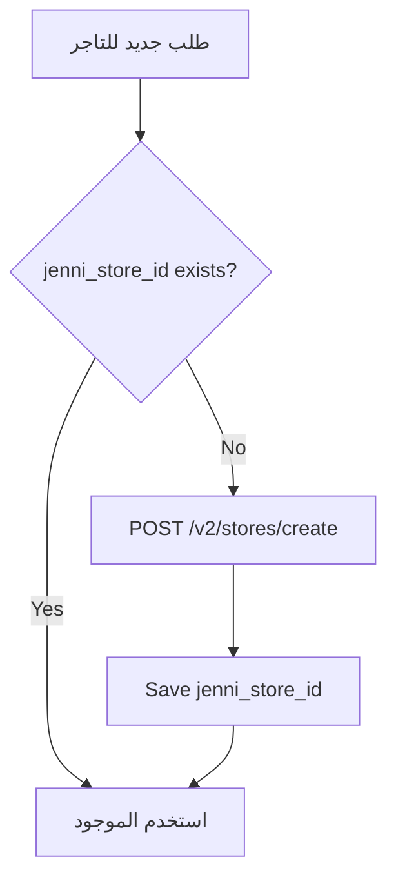

# 🔧 JENNI REFACTOR PLAN — خطة إعادة البناء التفصيلية

> **Version**: 3.0 (Post-Supervisor Review)  
> **Date**: 2026-06-15  
> **Status**: 🟡 REVISED — تم تعديل الخطة بناءً على مراجعة المشرف المعماري  
> **المرجع**: [JENNI_INTEGRATION_FINAL_CONTRACT.md](./JENNI_INTEGRATION_FINAL_CONTRACT.md)

---

## 🎯 الهدف

تحويل ربط Jenni من **dispatch بسيط** إلى نظام يدعم:

1. ربط `store_id` مع كل شحنة (نقطة استلام لكل تاجر)
2. إضافة flow الستكر/الباركود (proxy أولاً)
3. تصحيح mapping حالة `NEW_WITH_PA` → `picked_up`
4. حفظ بيانات التسوية الخام (بدون بناء reconciliation كامل)

> [!WARNING]
> **ما لا نفعله في هذه المرحلة:**
>
> - ❌ لا نوسع delivery_status من 9 إلى 16 حالة
> - ❌ لا نبني settlement service كامل قبل اختبار API 35
> - ❌ لا نفترض أن كل تاجر = Merchant — نختبر أولاً

---

## 📋 ملخص التغييرات

| الفئة                  | ملفات جديدة | ملفات معدّلة | Migrations |
| ---------------------- | ----------- | ------------ | ---------- |
| Phase 0 - API Spike    | 1 (script)  | —            | —          |
| Backend - Jenni Module | 2           | 4            | —          |
| Database (Migrations)  | —           | —            | 1          |
| Frontend               | —           | 2            | —          |
| **المجموع**            | **3**       | **6**        | **1**      |

---

## ⭐ Phase 0: Jenni Identity Model Spike (إلزامي قبل أي migration)

> [!CAUTION]
> **لا تضف أي migrations نهائية قبل نتيجة هذا الاختبار.**

### الهدف

حسم هل نستخدم:

- **A)** DilMart merchant + stores فقط (المفضّل)
- **B)** Aggregator + merchant per trader + store per trader

### المهام

```
1. ✅ اختبر POST /v2/stores/create بدون merchant_id
   → هل ينجح؟ هل الـ store ينتمي لحساب DilMart الرئيسي؟

2. ✅ اختبر POST /v2/stores/create باستخدام merchant_id الخاص بـ DilMart
   → هل يعمل؟

3. ✅ اختبر POST /v2/shipments/create باستخدام store_id فقط (من خطوة 1 أو 2)
   → هل الشحنة تُقبل؟ هل مندوب الاستلام يعرف أين يذهب؟

4. ✅ اختبر POST /v2/merchant-management/create ثم /v2/stores/create مع merchant_id
   → هل التحاسب المالي يبقى مع DilMart أم ينتقل للـ Merchant الجديد؟

5. 📝 وثّق النتائج في docs/JENNI_PHASE0_RESULTS.md
```

### Script الاختبار

**الملف**: `backend/scripts/jenni-identity-spike.ts`

```typescript
// Script يختبر السيناريوهات الأربعة أعلاه
// يستخدم JenniClientService مباشرة
// يطبع النتائج بشكل واضح
// لا يُنشئ شحنات حقيقية — يستخدم test/staging credentials
```

### المخرجات المتوقعة

| السيناريو                    | إذا نجح           | القرار                             |
| ---------------------------- | ----------------- | ---------------------------------- |
| Store بدون merchant_id       | نعتمد الخيار A ✅ | أبسط — كل تاجر = Store تحت DilMart |
| Store مع merchant_id DilMart | نعتمد الخيار A ✅ | نفس النتيجة                        |
| فقط Merchant + Store يعمل    | نعتمد الخيار B ⚠️ | مع ضمان أن التحاسب يبقى مع DilMart |

---

## Phase 1: Database Migration (بعد Phase 0)

### 1.1 [NEW] Migration: Extend `stores` + `order_delivery_integrations`

**الملف**: `supabase/migrations/xxx_jenni_store_integration.sql`

```sql
-- ✅ ربط التاجر المحلي بنقطة الاستلام في Jenni
ALTER TABLE stores ADD COLUMN IF NOT EXISTS jenni_store_id INTEGER;
ALTER TABLE stores ADD COLUMN IF NOT EXISTS jenni_synced_at TIMESTAMPTZ;

-- فقط إذا Phase 0 أثبت الحاجة للخيار B:
-- ALTER TABLE stores ADD COLUMN IF NOT EXISTS jenni_merchant_id INTEGER;

CREATE INDEX IF NOT EXISTS idx_stores_jenni_store_id ON stores(jenni_store_id);

-- ✅ حقول التسوية الخام في integration row
ALTER TABLE order_delivery_integrations
  ADD COLUMN IF NOT EXISTS jenni_store_id INTEGER,
  ADD COLUMN IF NOT EXISTS jenni_settlement_id INTEGER DEFAULT 0,
  ADD COLUMN IF NOT EXISTS delivery_cost_actual NUMERIC(12,2),
  ADD COLUMN IF NOT EXISTS cod_collected NUMERIC(12,2);
```

> ⚠️ **لا migration لتوسيع delivery_status enum.** نبقي الحالات الـ 9 الحالية.

---

## Phase 2: Backend — Jenni Module

### 2.1 [NEW] `jenni-store-provisioning.service.ts`

**الغرض**: إدارة إنشاء Stores (أو Merchants إذا لزم) في Jenni

```typescript
class JenniStoreProvisioningService {
  // ✅ Lazy provisioning: يتأكد من الوجود أو ينشئ عند أول طلب
  async getOrCreateJenniStoreId(localStoreId: string): Promise<number>;

  // ✅ إنشاء Store في Jenni (الخيار A أو B حسب Phase 0)
  private async createStoreInJenni(
    store: LocalStore,
  ): Promise<{ jenni_store_id: number }>;

  // ✅ فقط إذا الخيار B: إنشاء Merchant أولاً
  private async ensureMerchantInJenni(storeId: string): Promise<number | null>;
}
```

**Flow (Lazy Provisioning):**



---

### 2.2 [NEW] `jenni-sticker.service.ts`

**الغرض**: Proxy لطلب الستكرات من Jenni

```typescript
class JenniStickerService {
  // ✅ Proxy: يجلب PDF من Jenni ويمرره مباشرة
  async getSticker(shipmentNumber: string): Promise<Buffer>;

  // المرحلة 2 (لاحقاً): تخزين في Supabase Storage
  // async generateAndStore(shipmentNumber: string): Promise<string>
}
```

**API Call:**

```
POST /v2/shipments/stickers
Body: { "shipment_numbers": ["ORD-XXX"], "width_mm": 100, "height_mm": 150 }
Response: Binary PDF → يُمرر مباشرة للعميل
```

---

### 2.3 [MODIFY] `jenni-dispatch.service.ts`

[jenni-dispatch.service.ts](file:///e:/Project/DilMart-Store/backend/src/modules/jenni/jenni-dispatch.service.ts)

```diff
 // 1. Lazy provisioning للـ store قبل الإرسال
+ const jenniStoreId = await this.storeProvisioningService.getOrCreateJenniStoreId(order.store_id);

 // 2. إضافة store_id للـ payload
 const payload: JenniCreateShipmentPayload = {
   shipment_number: order.order_number,
   external_shipment_id: order.id,
   receiver_name: ...,
   ...
+  store_id: jenniStoreId,
 };

 // 3. حفظ jenni_store_id في integration row
+ integration.jenni_store_id = jenniStoreId;
```

---

### 2.4 [MODIFY] `jenni-status-mapper.ts`

[jenni-status-mapper.ts](file:///e:/Project/DilMart-Store/backend/src/modules/jenni/jenni-status-mapper.ts)

**التغييرات**: تصحيح `NEW_WITH_PA` و `IN_SC`

```diff
 const STEP_MAP: Record<string, DeliveryStatus> = {
   NEW_ORDER_TO_PRINT: "assigned_to_company",
   NEW_ORDER_TO_PICKUP: "assigned_to_company",
-  NEW_WITH_PA: "assigned_to_company",
+  NEW_WITH_PA: "picked_up",           // ✅ تصحيح: أول scan = picked_up
-  IN_SC: "picked_up",
+  IN_SC: "in_transit",                // ✅ تصحيح: مركز الفرز = بعد الاستلام = in_transit
   OFD: "in_transit",                   // يبقى كما هو
   DELIVERED: "delivered",
   ...
   POSTPONED: "in_transit",             // يبقى in_transit + event metadata
   DELIVERY_REATTEMPT: "in_transit",    // يبقى in_transit
   ...
   // كل حالات Return تبقى → "returned"
 };
```

> **الباقي لا يتغير.** التفاصيل الدقيقة (أي مرحلة داخل Jenni بالضبط) تُحفظ في `provider_current_step`.

---

### 2.5 [MODIFY] `jenni-sync.service.ts`

[jenni-sync.service.ts](file:///e:/Project/DilMart-Store/backend/src/modules/jenni/jenni-sync.service.ts)

```diff
 // 1. حفظ بيانات التسوية الخام عند query sync
+ if (queryShipment.merchant_settlement_id && queryShipment.merchant_settlement_id > 0) {
+   await this.updateIntegration(orderId, {
+     jenni_settlement_id: queryShipment.merchant_settlement_id,
+     delivery_cost_actual: queryShipment.shipment_cost,
+     cod_collected: queryShipment.amount_iqd,
+   });
+ }

 // 2. حفظ metadata إضافية في delivery_events
+ // سبب التأجيل، سبب الإرجاع، تاريخ التأجيل
+ // كلها تُحفظ في event.metadata (JSON) وليس كحالات جديدة
```

---

### 2.6 [MODIFY] `jenni.types.ts`

[jenni.types.ts](file:///e:/Project/DilMart-Store/backend/src/modules/jenni/jenni.types.ts)

```diff
 export type JenniCreateShipmentPayload = {
   shipment_number: string;
   external_shipment_id: string;
   receiver_name: string;
   receiver_phone_1: string;
+  receiver_phone_2?: string;
   governorate_code: string;
   city: string;
   address: string;
   amount_iqd: number;
+  amount_usd?: number;
   quantity: number;
   product_info: string;
   note?: string | null;
+  store_id?: number;                   // ✅ NEW
+  is_proof_of_delivery?: boolean;
+  is_fragile?: boolean;
+  have_return_item?: boolean;
+  is_special_case?: boolean;
 };

+export type JenniStoreCreatePayload = {
+  store_name: string;
+  store_phone?: string;
+  governorate_code?: string;
+  address?: string;
+  latitude?: number;
+  longitude?: number;
+  merchant_id?: number;  // فقط في الخيار B
+};
```

---

### 2.7 [MODIFY] `jenni.module.ts`

[jenni.module.ts](file:///e:/Project/DilMart-Store/backend/src/modules/jenni/jenni.module.ts)

```diff
+import { JenniStoreProvisioningService } from './jenni-store-provisioning.service';
+import { JenniStickerService } from './jenni-sticker.service';

 providers: [
   ...existing,
+  JenniStoreProvisioningService,
+  JenniStickerService,
 ],
 exports: [
   ...existing,
+  JenniStoreProvisioningService,
+  JenniStickerService,
 ],
```

---

## Phase 3: Backend — Orders (Endpoints)

### 3.1 [MODIFY] `orders.controller.ts`

```typescript
// ✅ Proxy endpoint للستكر — يمرر PDF من Jenni مباشرة
@Get(':orderId/sticker')
@Header('Content-Type', 'application/pdf')
async getSticker(@Param('orderId') orderId: string, @Res() res: Response) {
  const pdfBuffer = await this.jenniStickerService.getSticker(orderId);
  res.send(pdfBuffer);
}

// ✅ إلغاء شحنة في Jenni
@Delete(':orderId/jenni-shipment')
async cancelJenniShipment(@Param('orderId') orderId: string) {
  // DELETE /v2/orders/{shipment_id}
}

// ✅ تعديل COD
@Patch(':orderId/jenni-cod')
async modifyJenniCod(@Param('orderId') orderId: string, @Body() body: {amount_iqd: number}) {
  // PUT /v2/shipments/edit
}
```

---

## Phase 4: Frontend Changes (Minimal)

### 4.1 [MODIFY] Admin — `OrderDetail.tsx`

[OrderDetail.tsx](file:///e:/Project/DilMart-Store/src/pages/admin/OrderDetail.tsx)

```diff
 // 1. عرض provider_current_step الدقيق بجانب delivery_status
+{integration?.provider_current_step && (
+  <Badge variant="outline">{integration.provider_current_step_ar || integration.provider_current_step}</Badge>
+)}

 // 2. زر طباعة الستكر (proxy)
+{integration?.dispatch_status === 'dispatched' && (
+  <Button onClick={() => window.open(`/api/orders/${orderId}/sticker`)}>
+    🏷️ طباعة الستكر
+  </Button>
+)}

 // 3. زر إلغاء الشحنة (فقط قبل الاستلام)
+{canCancel && (
+  <Button variant="destructive" onClick={cancelJenniShipment}>
+    ❌ إلغاء الشحنة
+  </Button>
+)}
```

### 4.2 [MODIFY] Admin — `DeliveryOps.tsx`

[DeliveryOps.tsx](file:///e:/Project/DilMart-Store/src/pages/admin/DeliveryOps.tsx)

```diff
 // عرض provider_current_step في عمود إضافي
+<Column header="حالة Jenni" render={row => row.provider_current_step_ar || '—'} />
```

---

## Phase 5: Verification Plan

### 5.1 Automated Tests

```bash
# Unit Tests
npm run test -- --testPathPattern="jenni-store-provisioning"
npm run test -- --testPathPattern="jenni-sticker"
npm run test -- --testPathPattern="jenni-status-mapper"
```

### 5.2 Manual Verification

| #   | الاختبار                            | الطريقة                              |
| --- | ----------------------------------- | ------------------------------------ |
| 1   | **Phase 0** — اختبار Identity Model | تشغيل spike script → توثيق النتائج   |
| 2   | إنشاء Store في Jenni                | موافقة تاجر + التحقق                 |
| 3   | إنشاء Shipment مع store_id          | إرسال طلب + التحقق من payload        |
| 4   | الستكر — Proxy PDF                  | طباعة + مسح الباركود                 |
| 5   | Webhook: NEW_WITH_PA → picked_up    | محاكاة webhook                       |
| 6   | Webhook: كل الحالات الأخرى          | التحقق من provider_current_step      |
| 7   | إلغاء شحنة                          | إلغاء قبل الاستلام                   |
| 8   | تعديل COD                           | تغيير المبلغ + التحقق                |
| 9   | بيانات التسوية الخام                | query sync + التحقق من settlement_id |

### 5.3 Backwards Compatibility

- ✅ الطلبات القديمة تبقى تعمل (mapping لم يتغير جذرياً)
- ✅ Webhooks القديمة مدعومة (التغيير الوحيد: `NEW_WITH_PA` يصير `picked_up` بدل `assigned_to_company`)
- ✅ State machine بدون تغيير — لا migrations خطرة
- ✅ لا يتأثر flow الـ checkout أو pricing

---

## 📅 ترتيب التنفيذ

```
Phase 0 → (قرار) → Phase 1 → Phase 2 → Phase 3 → Phase 4 → Phase 5
  Spike    Review    DB        Jenni     Orders    Frontend   Test
   ↓                 ↓        Module
  2hrs              30min     3-4hrs     1hr       1-2hrs     1-2hrs
```

**الوقت التقديري**: 8-11 ساعة عمل

---

## ✅ قرارات محسومة (من المشرف)

| #   | القرار                   | النتيجة                                            |
| --- | ------------------------ | -------------------------------------------------- |
| Q1  | هل كل تاجر = Merchant?   | ❌ **لا** — نفضّل Stores فقط. يُحسم في Phase 0     |
| Q2  | متى ننشئ Store في Jenni? | **Lazy** — عند أول dispatch                        |
| Q3  | الستكر تلقائي أم يدوي?   | **تلقائي** — بعد dispatch مباشرة (proxy)           |
| Q4  | توسيع State Machine?     | ❌ **لا** — نبقي 9 حالات + `provider_current_step` |
| Q5  | Settlement service كامل? | ❌ **لا** — حفظ بيانات خام فقط حتى اختبار API 35   |
| Q6  | تخزين PDF?               | ❌ **لا** — Proxy أولاً، تخزين لاحقاً إذا لزم      |

---

## 📝 ملاحظات للتنفيذ

1. **Phase 0 إلزامي** — لا migration قبل نتائجه.
2. **لا تحذف أي كود قائم** — أضف فقط. الكود القديم يبقى كـ fallback.
3. **التغيير الوحيد في status mapper**: `NEW_WITH_PA` → `picked_up`.
4. **Backwards compatible**: كل webhook قديم يبقى يعمل.
5. **Feature flag اختياري**: `JENNI_STORE_FLOW_ENABLED=true` للتحكم بالتفعيل التدريجي.
