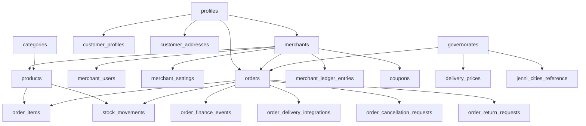

# DILMART — STAGE B DATABASE AUTHORITY INVENTORY
**Generated:** 2026-08-30 | **Status:** READ-ONLY AUDIT BASELINE | **Baseline Commit:** `62922bb`

---

## 1. Executive Summary

This document establishes the authoritative PostgreSQL database inventory for **DILMART-Store** (`ztplxqlthuqkuktbznbo`). The catalog comprises:
- **Total Tables Audited:** 72 tables (71 active tables, 1 dropped table: `public.user_roles`).
- **Total Functions Audited:** 82 functions across `public`, `app_private`, and `auth`.
- **Total Triggers Audited:** 21 triggers.
- **Total Views Audited:** 4 views (`v_delivery_intelligence_summary`, `v_delivery_courier_metrics`, `v_delivery_governorate_performance`, `v_delivery_merchant_profile`).
- **Total Storage Buckets Audited:** 3 buckets (`product-images`, `merchant-assets`, `avatars`).

---

## 2. Complete Table Catalog & Structural Schema

### Core Marketplace Tables
1. **`public.merchants`**
   - **Columns:** `id (uuid, PK)`, `display_name (text)`, `legal_name (text)`, `slug (text, UNIQUE)`, `status (text)`, `business_type (text)`, `owner_id (uuid, FK -> profiles.id)`, `governorate_id (uuid, FK -> governorates.id)`, `city (text)`, `phone (text)`, `email (text)`, `commission_rate (numeric)`, `logo_url (text)`, `banner_url (text)`, `settings (jsonb)`, `created_at (timestamptz)`, `updated_at (timestamptz)`.
   - **RLS Enabled:** `true`
   - **Inbound FKs:** `merchant_users.merchant_id`, `products.merchant_id`, `orders.merchant_id`, `order_items.merchant_id`, `merchant_ledger_entries.merchant_id`, `merchant_payout_batches.merchant_id`, `merchant_commercial_terms.merchant_id`, `merchant_policy_assignments.merchant_id`, `merchant_settings.merchant_id`, `coupons.merchant_id`, `product_import_sessions.merchant_id`, `audit_logs.merchant_id`, `store_carts.merchant_id`, `store_cart_items.merchant_id`.

2. **`public.merchant_users`**
   - **Columns:** `id (uuid, PK)`, `merchant_id (uuid, FK -> merchants.id)`, `user_id (uuid, FK -> profiles.id)`, `role (text)`, `status (text)`, `created_at (timestamptz)`, `updated_at (timestamptz)`.
   - **Unique Constraints:** `(merchant_id, user_id)`
   - **RLS Enabled:** `true`

3. **`public.merchant_settings`**
   - **Columns:** `id (uuid, PK)`, `merchant_id (uuid, UNIQUE, FK -> merchants.id)`, `settings (jsonb)`, `created_at (timestamptz)`, `updated_at (timestamptz)`.
   - **RLS Enabled:** `true`

4. **`public.categories`**
   - **Columns:** `id (uuid, PK)`, `name (text)`, `slug (text, UNIQUE)`, `parent_id (uuid, FK -> categories.id)`, `icon_url (text)`, `image_url (text)`, `sort_order (integer)`, `is_active (boolean)`, `display_mode (text)`, `metadata (jsonb)`, `created_at (timestamptz)`, `updated_at (timestamptz)`.
   - **RLS Enabled:** `true`
   - **Inbound FKs:** `categories.parent_id`, `products.category_id`.

5. **`public.products`**
   - **Columns:** `id (uuid, PK)`, `merchant_id (uuid, FK -> merchants.id)`, `category_id (uuid, FK -> categories.id)`, `name (text)`, `slug (text)`, `sku (text)`, `barcode (text)`, `short_description (text)`, `description (text)`, `price (numeric)`, `discount_price (numeric)`, `cost_price (numeric)`, `stock (integer)`, `low_stock_threshold (integer)`, `is_published (boolean)`, `is_active (boolean)`, `visibility_status (text)`, `is_ready_for_listing (boolean, generated)`, `visible_in (text[])`, `target_audience (text[])`, `purchase_mode (text[])`, `min_order_qty (integer)`, `max_order_qty (integer)`, `requires_verified_salon (boolean)`, `images (jsonb)`, `attributes (jsonb)`, `tags (text[])`, `created_at (timestamptz)`, `updated_at (timestamptz)`.
   - **RLS Enabled:** `true`
   - **Inbound FKs:** `order_items.product_id`, `stock_movements.product_id`, `store_cart_items.product_id`.

6. **`public.stock_movements`**
   - **Columns:** `id (uuid, PK)`, `product_id (uuid, FK -> products.id)`, `merchant_id (uuid, FK -> merchants.id)`, `movement_type (text)`, `quantity_change (integer)`, `previous_stock (integer)`, `new_stock (integer)`, `order_id (uuid, FK -> orders.id)`, `reference_id (text)`, `actor_id (uuid)`, `notes (text)`, `created_at (timestamptz)`.
   - **RLS Enabled:** `true`

7. **`public.orders`**
   - **Columns:** `id (uuid, PK)`, `order_number (text, UNIQUE)`, `customer_id (uuid, FK -> profiles.id)`, `merchant_id (uuid, FK -> merchants.id)`, `governorate_id (uuid, FK -> governorates.id)`, `status (text)`, `merchant_decision_status (text)`, `payment_status (text)`, `payment_method (text)`, `collection_status (text)`, `settlement_status (text)`, `channel (text)`, `source_app (text)`, `subtotal (numeric)`, `discount (numeric)`, `delivery_cost (numeric)`, `total (numeric)`, `merchandise_subtotal (numeric)`, `discount_total (numeric)`, `delivery_fee_charged (numeric)`, `platform_commission_amount (numeric)`, `courier_fee_payable (numeric)`, `merchant_net_amount (numeric)`, `gross_collected_amount (numeric)`, `cash_expected_amount (numeric)`, `cash_received_amount (numeric)`, `cash_actual_remitted_amount (numeric)`, `cash_remittance_difference (numeric)`, `customer_name (text)`, `customer_phone (text)`, `area (text)`, `nearest_landmark (text)`, `notes (text)`, `merchant_notes (text)`, `agent_id (uuid, FK -> profiles.id)`, `coupon_id (uuid, FK -> coupons.id)`, `financial_snapshot_version (integer)`, `commercial_snapshot_version (integer)`, `created_at (timestamptz)`, `updated_at (timestamptz)`.
   - **RLS Enabled:** `true`
   - **Inbound FKs:** `order_items.order_id`, `order_finance_events.order_id`, `order_delivery_integrations.order_id`, `stock_movements.order_id`, `order_cancellation_requests.order_id`, `order_cancellation_operations.order_id`, `order_return_requests.order_id`, `delivery_events.order_id`.

8. **`public.order_items`**
   - **Columns:** `id (uuid, PK)`, `order_id (uuid, FK -> orders.id)`, `product_id (uuid, FK -> products.id)`, `merchant_id (uuid, FK -> merchants.id)`, `product_name (text)`, `unit_price (numeric)`, `quantity (integer)`, `line_total (numeric)`, `created_at (timestamptz)`.
   - **RLS Enabled:** `true`

9. **`public.checkout_attempts`**
   - **Columns:** `id (uuid, PK)`, `request_hash (text)`, `user_id (uuid, FK -> profiles.id)`, `status (text)`, `order_id (uuid, FK -> orders.id)`, `order_number (text)`, `error_code (text)`, `error_message (text)`, `expires_at (timestamptz)`, `created_at (timestamptz)`, `updated_at (timestamptz)`.
   - **Unique Constraints:** `(user_id, request_hash)`
   - **RLS Enabled:** `true`

---

## 3. Financial & Accounting Ledger Schema

1. **`public.order_finance_events`**
   - **Columns:** `id (uuid, PK)`, `order_id (uuid, FK -> orders.id)`, `merchant_id (uuid, FK -> merchants.id)`, `event_type (text)`, `idempotency_key (text, UNIQUE)`, `gross_amount (numeric)`, `discount_amount (numeric)`, `delivery_fee (numeric)`, `commission_amount (numeric)`, `merchant_net (numeric)`, `courier_fee (numeric)`, `platform_net (numeric)`, `actor_id (uuid)`, `metadata (jsonb)`, `created_at (timestamptz)`.
   - **RLS Enabled:** `true`

2. **`public.merchant_ledger_entries`**
   - **Columns:** `id (uuid, PK)`, `merchant_id (uuid, FK -> merchants.id)`, `order_id (uuid, FK -> orders.id)`, `entry_type (text: 'credit'|'debit')`, `amount (numeric)`, `balance_after (numeric)`, `idempotency_key (text, UNIQUE)`, `reference_type (text)`, `reference_id (text)`, `created_at (timestamptz)`.
   - **RLS Enabled:** `true`

3. **`public.merchant_payout_batches`**
   - **Columns:** `id (uuid, PK)`, `batch_number (text, UNIQUE)`, `status (text)`, `total_amount (numeric)`, `item_count (integer)`, `approved_by (uuid)`, `created_at (timestamptz)`, `updated_at (timestamptz)`.
   - **RLS Enabled:** `true`

4. **`public.merchant_payout_batch_items`**
   - **Columns:** `id (uuid, PK)`, `batch_id (uuid, FK -> merchant_payout_batches.id)`, `merchant_id (uuid, FK -> merchants.id)`, `amount (numeric)`, `status (text)`, `notes (text)`, `created_at (timestamptz)`.
   - **RLS Enabled:** `true`

5. **`public.courier_ledger_entries`**
   - **Columns:** `id (uuid, PK)`, `courier_id (uuid)`, `order_id (uuid, FK -> orders.id)`, `entry_type (text)`, `amount (numeric)`, `balance_after (numeric)`, `idempotency_key (text, UNIQUE)`, `created_at (timestamptz)`.
   - **RLS Enabled:** `true`

6. **`public.courier_payout_batches`** & **`public.courier_payout_batch_items`**
   - **Columns:** Analogous payout batching tables for logistics providers.
   - **RLS Enabled:** `true`

---

## 4. Delivery & Logistics Integration Schema

1. **`public.governorates`**
   - **Columns:** `id (uuid, PK)`, `name (text)`, `name_en (text)`, `is_active (boolean)`, `created_at (timestamptz)`.
   - **RLS Enabled:** `true`

2. **`public.regions`**
   - **Columns:** `id (uuid, PK)`, `governorate_id (uuid, FK -> governorates.id)`, `name (text)`, `created_at (timestamptz)`.
   - **RLS Enabled:** `true`

3. **`public.delivery_prices`**
   - **Columns:** `id (uuid, PK)`, `governorate_id (uuid, FK -> governorates.id)`, `price (numeric)`, `created_at (timestamptz)`, `updated_at (timestamptz)`.
   - **RLS Enabled:** `true`

4. **`public.order_delivery_integrations`**
   - **Columns:** `id (uuid, PK)`, `order_id (uuid, UNIQUE, FK -> orders.id)`, `provider (text: 'jenni')`, `provider_order_id (text)`, `tracking_number (text)`, `status (text)`, `sticker_url (text)`, `dispatch_attempts (integer)`, `last_error (text)`, `raw_response (jsonb)`, `created_at (timestamptz)`, `updated_at (timestamptz)`.
   - **RLS Enabled:** `true`

5. **`public.jenni_cities_reference`**
   - **Columns:** `id (uuid, PK)`, `governorate_id (uuid, FK -> governorates.id)`, `jenni_city_code (text)`, `jenni_city_name (text)`, `is_active (boolean)`.
   - **RLS Enabled:** `true`

6. **`public.jenni_merchant_provisioning_locks`** & **`public.jenni_store_provisioning_locks`**
   - **Columns:** Mutex tables for safe aggregator provisioning.
   - **RLS Enabled:** `true`

---

## 5. Auth, Customer & Operational Schema

1. **`public.profiles`**
   - **Columns:** `id (uuid, PK, references auth.users.id)`, `full_name (text)`, `phone (text)`, `email (text)`, `role (text)`, `points (integer)`, `created_at (timestamptz)`, `updated_at (timestamptz)`.
   - **RLS Enabled:** `true` (Direct browser UPDATE revoked).

2. **`public.customer_profiles`** & **`public.customer_addresses`**
   - **Columns:** Customer address book and extended profile records.
   - **RLS Enabled:** `true`

3. **`public.coupons`**
   - **Columns:** `id (uuid, PK)`, `code (text, UNIQUE)`, `merchant_id (uuid, FK -> merchants.id, nullable)`, `discount_type (text: 'fixed'|'percentage')`, `value (numeric)`, `min_order_amount (numeric)`, `max_discount_amount (numeric)`, `usage_limit (integer)`, `usage_count (integer)`, `expires_at (timestamptz)`, `is_active (boolean)`, `created_at (timestamptz)`.
   - **RLS Enabled:** `true`

4. **`public.loyalty_settings`** & **`public.loyalty_transactions`**
   - **Columns:** Point ledger and conversion settings.
   - **RLS Enabled:** `true`

5. **`public.audit_logs`**
   - **Columns:** Append-only system audit log.
   - **RLS Enabled:** `true` (Admin only).

6. **`public.desktop_quick_links`** & **`public.marketplace_banners`**
   - **Columns:** Visual marketing and UI navigational banners.
   - **RLS Enabled:** `true`

---

## 6. Legacy Database Tables (Stage A Residue)

1. **`public.store_linked_profiles`** (Created in `20260601110000_m27_store_linked_profiles.sql`)
2. **`public.store_carts`** (Created in `20260607100000_m29_store_b2b_cart.sql`)
3. **`public.store_cart_items`** (Created in `20260607100000_m29_store_b2b_cart.sql`)
4. **`public.store_federated_session_families`** (Created in `20260805100200_customer_handoff_session_foundations.sql`)
5. **`public.store_federated_refresh_tokens`** (Created in `20260805100200_customer_handoff_session_foundations.sql`)
6. **`public.store_federated_session_audit_events`** (Created in `20260806100000_federated_session_hardening.sql`)
7. **`public.DilMart_customer_handoffs`** (Created in `20260805100100_customer_handoff_core.sql`)
8. **`public.DilMart_customer_handoff_audit_events`** (Created in `20260805100100_customer_handoff_core.sql`)
9. **`public.DilMart_barber_handoffs`** (Created in `20260819100000_barber_handoff_core.sql`)
10. **`public.DilMart_barber_handoff_audit_events`** (Created in `20260819100000_barber_handoff_core.sql`)
11. **`public.DilMart_barber_web_sessions`** (Created in `20260819100200_barber_web_sessions.sql`)

---

## 7. Complete Inbound / Outbound Foreign Key Dependency Graph

