# DILMART — STAGE B FUTURE MARKETPLACE ARCHITECTURE GAPS & HUB FULFILLMENT MODEL
**Generated:** 2026-08-30 | **Status:** READ-ONLY AUDIT BASELINE | **Baseline Commit:** `62922bb`

---

## 1. Architectural Evolution Roadmap

The current baseline operates on a **Single-Merchant Direct Fulfillment** model `[CONFIRMED BY CODE]`.
The target DILMART architecture evolves toward a **Consolidated Multi-Merchant Marketplace with a Collection Point & Regional Hub Network** `[INFERRED]`.

```mermaid
graph TD
    subgraph "Current Baseline Model (Single-Merchant Direct)"
        A[Customer Cart: Single Merchant] --> B[Single Order]
        B --> C[Merchant Prepares Goods]
        C --> D[Carrier Picks Up Directly from Merchant]
        D --> E[Direct Delivery to Customer]
    end

    subgraph "Target DILMART Architecture (Multi-Merchant & Hub Network)"
        F[Customer Multi-Merchant Cart] --> G[Order Group / Parent Order]
        G --> H1[Child Order: Merchant A]
        G --> H2[Child Order: Merchant B]
        H1 --> I1[DILMART Pickup Agent Collects from Merchant A]
        H2 --> I2[DILMART Pickup Agent Collects from Merchant B]
        I1 --> J[Collection Point / Regional Hub Network]
        I2 --> J
        J --> K[Consolidated Package Assembly & Quality Scan]
        K --> L[Last-Mile Delivery Carrier]
        L --> M[Single Consolidated Delivery to Customer]
    end
```

---

## 2. Gap Analysis & Impact Breakdown

### 1. Multi-Merchant Cart & Order Grouping
- **Current State:** Single merchant per cart invariant is enforced in `src/lib/cart-store.ts` and `backend/src/modules/checkout/checkout.service.ts` (`merchantIds.size === 1`) `[CONFIRMED BY CODE]`.
- **Required Architecture Changes:**
  - Introduce `public.order_groups` table with `(id, group_number, customer_id, total_amount, payment_status, collection_status, delivery_address_id, created_at)`.
  - Transform `public.orders` to link `order_group_id UUID REFERENCES public.order_groups(id)`.
  - Update `place_order_idempotent` RPC to create parent `order_group` and split child orders atomically.

### 2. Multi-Leg Fulfillment & Collection Point / Hub Network
- **Current State:** Direct merchant-to-courier dispatch via Jenni API `[CONFIRMED BY CODE]`.
- **Required Architecture Changes:**
  - Introduce `public.collection_points` (Hubs/Warehouses/Sorting Centers) table with regional capacity, scanning endpoints, and route manifests.
  - Introduce `public.pickup_runs` & `public.pickup_run_items` for DILMART collection agents.
  - Extended Order Lifecycle State Machine:
    `pending` ➔ `accepted_by_merchant` ➔ `preparing` ➔ `ready_for_pickup` ➔ `picked_up_by_agent` ➔ `received_at_hub` ➔ `consolidated` ➔ `out_for_delivery` ➔ `delivered`.

### 3. Comprehensive Logistics Cost Structure
The target financial engine must explicitly separate the **customer-facing delivery charge** from internal multi-leg operational cost allocations:
- **Customer-Facing Delivery Charge:** Flat or distance-based fee billed to customer at checkout.
- **Internal Multi-Leg Cost Allocations:**
  1. `merchant_pickup_cost` (Agent collection from merchant location).
  2. `hub_handling_cost` (Sorting, verification, and consolidated packing at the Collection Point).
  3. `inter_hub_transport_cost` (Transit between regional sorting hubs).
  4. `last_mile_carrier_cost` (Final courier delivery fee).
  5. `platform_subsidy` (Promotional delivery discounts absorbed by DILMART).
  6. `merchant_subsidy` (Delivery contributions funded by the merchant).

### 4. Package Chain of Custody & Barcode Security
- **Current State:** Single tracking number per order via Jenni `[CONFIRMED BY CODE]`.
- **Required Architecture Changes:**
  - Introduce `public.package_containers` and barcode scanning verification at handoff points.
  - Audit logging of custody transfers (`merchant` ➔ `pickup agent` ➔ `hub intake scanner` ➔ `hub consolidation scanner` ➔ `last-mile courier`).

### 5. Split Financial Settlements & Child Order Accounting
- **Current State:** Financial snapshot computed per order `[CONFIRMED BY CODE]`.
- **Required Architecture Changes:**
  - Customer checkout payment recorded at the `order_groups` level.
  - Merchant net amounts, commission deductions, and payout ledgers settled independently per child merchant order.
