# DILMART — STAGE B FUTURE MARKETPLACE ARCHITECTURE GAPS
**Generated:** 2026-08-30 | **Status:** READ-ONLY AUDIT BASELINE | **Baseline Commit:** `62922bb`

---

## 1. Architectural Evolution Roadmap

The current baseline operates on a **Single-Merchant Direct Fulfillment** model.
The target DILMART architecture evolves toward a **Consolidated Multi-Merchant Marketplace with Hub Fulfillment**.

```mermaid
graph TD
    subgraph "Current Baseline Model"
        A[Customer Cart Single Merchant] --> B[Single Order]
        B --> C[Merchant Prepares]
        C --> D[Courier Picks Up from Merchant]
        D --> E[Delivery to Customer]
    end

    subgraph "Target DILMART Architecture"
        F[Customer Multi-Merchant Cart] --> G[Order Group / Parent Order]
        G --> H1[Child Order Merchant 1]
        G --> H2[Child Order Merchant 2]
        H1 --> I1[DILMART Pickup Agent Collects]
        H2 --> I2[DILMART Pickup Agent Collects]
        I1 --> J[Central DILMART Consolidation Hub]
        I2 --> J
        J --> K[Consolidated Package Assembly]
        K --> L[Last-Mile Delivery Carrier]
        L --> M[Single Delivery to Customer]
    end
```

---

## 2. Gap Analysis & Impact Breakdown

### 1. Multi-Merchant Cart & Order Grouping
- **Current State:** Single merchant per cart invariant is enforced in `src/lib/cart-store.ts` and `backend/src/modules/checkout/checkout.service.ts` (`merchantIds.size === 1`).
- **Required Architecture Changes:**
  - Introduce `public.order_groups` table with `(id, group_number, customer_id, total_amount, payment_status, collection_status, delivery_address_id, created_at)`.
  - Transform `public.orders` to link `order_group_id UUID REFERENCES public.order_groups(id)`.
  - Update `place_order_idempotent` RPC to create parent `order_group` and split child orders atomically.

### 2. Multi-Leg Fulfillment & Pickup Agent Flow
- **Current State:** Direct merchant-to-courier dispatch via Jenni API.
- **Required Architecture Changes:**
  - Introduce `public.pickup_runs` & `public.pickup_run_items` for DILMART collection agents.
  - Introduce `public.collection_points` (Hubs/Warehouses) table with capacity and scanning support.
  - Lifecycle state machine extension:
    `preparing` -> `ready_for_pickup` -> `picked_up_by_agent` -> `received_at_hub` -> `consolidated` -> `out_for_delivery` -> `delivered`.

### 3. Package Chain of Custody & Barcode Security
- **Current State:** Single tracking number per order via Jenni.
- **Required Architecture Changes:**
  - Introduce `public.package_containers` and barcode scanning verification at handoff points.
  - Audit logging of custody transfers (`merchant -> agent -> hub scanner -> courier driver`).

### 4. Split Financial Settlements
- **Current State:** Financial snapshot computed per order.
- **Required Architecture Changes:**
  - Global checkout fees (single delivery fee to customer) apportioned across child orders or absorbed at the order group level.
  - Merchant net amounts settled independently per merchant child order.
