# DILMART — STAGE B PASS 2
# DATABASE DEPENDENCY GRAPH & RESTRICTED REMOVAL TOPOLOGY

**Generated:** 2026-08-30 | **Updated:** 2026-08-31 (Micro-Closure Patch) | **Status:** READ-ONLY AUDIT BASELINE
**Catalog Source:** `pg_constraint`, `pg_trigger`, `pg_proc`, `pg_index` on `ztplxqlthuqkuktbznbo`
**Authoritative Raw Data:** [`docs/stage-b/pass2/evidence/LIVE_LEGACY_DEPENDENCIES.json`](file:///d:/DilMart/docs/stage-b/pass2/evidence/LIVE_LEGACY_DEPENDENCIES.json)

---

## 1. Database Dependency Topology (Mermaid Graph)

```mermaid
graph TD
    subgraph RootParentTable ["Root Parent Table"]
        SLP["public.store_linked_profiles"]
    end

    subgraph IntermediateParentTables ["Intermediate Parent Tables"]
        SC["public.store_carts"]
        SFSF["public.store_federated_session_families"]
        DCH["public.dilmart_customer_handoffs"]
        DBH["public.dilmart_barber_handoffs"]
    end

    subgraph LeafTablesWithTriggers ["Leaf Tables with Mutation Triggers"]
        DBHAE["public.dilmart_barber_handoff_audit_events"]
        DCHAE["public.dilmart_customer_handoff_audit_events"]
        SFSAE["public.store_federated_session_audit_events"]
    end

    subgraph OtherLeafTables ["Other Leaf Tables (No Inbound FKs)"]
        SCI["public.store_cart_items"]
        SFRT["public.store_federated_refresh_tokens"]
        DBWS["public.dilmart_barber_web_sessions"]
    end

    subgraph TriggerFunctions ["Trigger Functions (Dependent on Tables/Triggers)"]
        TF_DBH["public.reject_barber_handoff_audit_mutation()"]
        TF_DCH["public.reject_handoff_audit_mutation()"]
        TF_SF["public.reject_federated_session_audit_mutation()"]
        TF_AUTH["public.reject_reserved_federated_email()"]
    end

    subgraph CrossSchemaAuth ["Cross-Schema Auth Guard"]
        AUTH_U["auth.users"]
    end

    subgraph NonLegacyActiveColumns ["Non-Legacy Active Tables (Foreign Keys & Constraints)"]
        O_SC["orders.store_cart_id"]
        O_SLP["orders.store_linked_profile_id"]
        CA_SC["checkout_attempts.store_cart_id"]
        CA_SLP["checkout_attempts.store_linked_profile_id"]
        CA_XOR["chk_checkout_attempts_owner_xor"]
    end

    %% Trigger attachments
    DBHAE -->|trg_reject_barber_handoff_audit_mutation| TF_DBH
    DCHAE -->|trg_reject_handoff_audit_mutation| TF_DCH
    SFSAE -->|trg_reject_federated_session_audit_mutation| TF_SF
    AUTH_U -->|trg_reject_reserved_federated_email| TF_AUTH

    %% Inbound FKs to store_linked_profiles
    SC -->|store_linked_profile_id_fkey| SLP
    SFSF -->|linked_profile_id_fkey| SLP
    DCH -->|linked_profile_id_fkey| SLP
    DBH -->|linked_profile_id_fkey| SLP
    DBWS -->|linked_profile_id_fkey| SLP
    O_SLP -->|orders_store_linked_profile_id_fkey| SLP
    CA_SLP -->|checkout_attempts_store_linked_profile_id_fkey| SLP

    %% Inbound FKs to store_carts
    SCI -->|store_cart_items_cart_id_fkey| SC
    O_SC -->|orders_store_cart_id_fkey| SC
    CA_SC -->|checkout_attempts_store_cart_id_fkey| SC

    %% Constraint dependencies
    CA_XOR -.->|references| CA_SC
    CA_XOR -.->|references| CA_SLP

    %% Inbound FKs to store_federated_session_families
    SFRT -->|session_family_id_fkey| SFSF
```



---

## 2. Strict Topological Removal Order (RESTRICT Rule)

To prevent foreign key, trigger, and constraint dependency violations without using destructive `CASCADE`, deletions must occur strictly in bottom-up order across bounded migrations:

### Phase 1: `place_order` Refactor (Migration A)
- Atomic rename-first transition of `place_order` to clean 49-parameter signature.

### Phase 2: Dead Non-Trigger RPCs (Migration B)
- Drop 15 standalone legacy functions that have 0 callers and 0 trigger attachments.

### Phase 3: Leaf Tables & Audit Triggers (Migration C)
- Drop 6 leaf tables and their 3 unreferenced audit trigger functions under `RESTRICT`.

### Phase 4: Intermediate Parent Tables & Active Table FKs (Migration D)
- Drop inbound FK constraints from `orders` and `checkout_attempts`.
- Drop 4 intermediate parent tables (`store_carts`, `store_federated_session_families`, `dilmart_customer_handoffs`, `dilmart_barber_handoffs`).
- Drop the root parent table (`store_linked_profiles`).

### Phase 5: Constraints, Legacy Columns & Indexes in Active Tables (Migration E)
- Drop and replace `chk_checkout_attempts_owner_xor` on `checkout_attempts`:
  ```sql
  ALTER TABLE public.checkout_attempts DROP CONSTRAINT chk_checkout_attempts_owner_xor;
  ALTER TABLE public.checkout_attempts ADD CONSTRAINT chk_checkout_attempts_user_id_not_null CHECK (user_id IS NOT NULL);
  ```
- Drop legacy columns from `checkout_attempts`: `store_cart_id`, `store_linked_profile_id`.
- Drop legacy columns from `orders`: `store_cart_id`, `store_linked_profile_id`, `dilmart_barbershop_id`, `dilmart_user_id`, `source_app`, `segment`, `business_type`.
- Drop legacy columns from `products` and `marketplace_banners`: `requires_verified_salon`.
