# DILMART — STAGE B PASS 2
# DATABASE DEPENDENCY GRAPH & RESTRICTED REMOVAL TOPOLOGY

**Generated:** 2026-08-30 | **Status:** READ-ONLY AUDIT BASELINE
**Catalog Source:** `pg_constraint`, `pg_depend`, `pg_trigger` on `ztplxqlthuqkuktbznbo`
**Raw Data Artifact:** [`docs/stage-b/pass2/evidence/LIVE_LEGACY_DEPENDENCIES.json`](file:///d:/DilMart/docs/stage-b/pass2/evidence/LIVE_LEGACY_DEPENDENCIES.json)

---

## 1. Database Dependency Topology (Mermaid Graph)

```mermaid
graph TD
    subgraph RootParentTable ["Root Parent Table"]
        SLP["public.store_linked_profiles"]
    end

    subgraph IntermediateParentTables ["Intermediate Parent Tables"]
        SC["public.store_carts"]
        SFSF["public.store_federated_session_families"]
        DCH["public.dilmart_customer_handoffs"]
        DBH["public.dilmart_barber_handoffs"]
    end

    subgraph LeafTables ["Leaf Tables (No Inbound FKs)"]
        SCI["public.store_cart_items"]
        SFRT["public.store_federated_refresh_tokens"]
        SFSAE["public.store_federated_session_audit_events"]
        DCHAE["public.dilmart_customer_handoff_audit_events"]
        DBHAE["public.dilmart_barber_handoff_audit_events"]
        DBWS["public.dilmart_barber_web_sessions"]
    end

    subgraph NonLegacyColumnsWithFKs ["Non-Legacy Tables (Foreign Keys to Legacy)"]
        O_SC["orders.store_cart_id"]
        O_SLP["orders.store_linked_profile_id"]
        CA_SC["checkout_attempts.store_cart_id"]
        CA_SLP["checkout_attempts.store_linked_profile_id"]
    end

    %% Inbound FKs to store_linked_profiles
    SC -->|store_linked_profile_id_fkey| SLP
    SFSF -->|linked_profile_id_fkey| SLP
    DCH -->|linked_profile_id_fkey| SLP
    DBH -->|linked_profile_id_fkey| SLP
    DBWS -->|linked_profile_id_fkey| SLP
    O_SLP -->|orders_store_linked_profile_id_fkey| SLP
    CA_SLP -->|checkout_attempts_store_linked_profile_id_fkey| SLP

    %% Inbound FKs to store_carts
    SCI -->|store_cart_items_cart_id_fkey| SC
    O_SC -->|orders_store_cart_id_fkey| SC
    CA_SC -->|checkout_attempts_store_cart_id_fkey| SC

    %% Inbound FKs to store_federated_session_families
    SFRT -->|session_family_id_fkey| SFSF
```

---

## 2. Strict Restricted Removal Order (RESTRICT Rule)

To prevent foreign key constraint violations without using destructive `CASCADE`, deletions must occur strictly in bottom-up topological order:

### Phase 1: Leaf Tables (Zero Inbound Dependencies)
1. `DROP TABLE public.store_cart_items RESTRICT;`
2. `DROP TABLE public.store_federated_refresh_tokens RESTRICT;`
3. `DROP TABLE public.store_federated_session_audit_events RESTRICT;`
4. `DROP TABLE public.dilmart_customer_handoff_audit_events RESTRICT;`
5. `DROP TABLE public.dilmart_barber_handoff_audit_events RESTRICT;`
6. `DROP TABLE public.dilmart_barber_web_sessions RESTRICT;`

### Phase 2: Foreign Key Constraints from Active Tables
7. `ALTER TABLE public.orders DROP CONSTRAINT orders_store_cart_id_fkey;`
8. `ALTER TABLE public.orders DROP CONSTRAINT orders_store_linked_profile_id_fkey;`
9. `ALTER TABLE public.checkout_attempts DROP CONSTRAINT checkout_attempts_store_cart_id_fkey;`
10. `ALTER TABLE public.checkout_attempts DROP CONSTRAINT checkout_attempts_store_linked_profile_id_fkey;`

### Phase 3: Intermediate Parent Tables
11. `DROP TABLE public.store_carts RESTRICT;`
12. `DROP TABLE public.store_federated_session_families RESTRICT;`
13. `DROP TABLE public.dilmart_customer_handoffs RESTRICT;`
14. `DROP TABLE public.dilmart_barber_handoffs RESTRICT;`

### Phase 4: Root Parent Table
15. `DROP TABLE public.store_linked_profiles RESTRICT;`

### Phase 5: Legacy Column Deletion (After `place_order` Refactor)
16. `ALTER TABLE public.orders DROP COLUMN store_cart_id RESTRICT;`
17. `ALTER TABLE public.orders DROP COLUMN store_linked_profile_id RESTRICT;`
18. `ALTER TABLE public.orders DROP COLUMN dilmart_barbershop_id RESTRICT;`
19. `ALTER TABLE public.orders DROP COLUMN dilmart_user_id RESTRICT;`
20. `ALTER TABLE public.checkout_attempts DROP COLUMN store_cart_id RESTRICT;`
21. `ALTER TABLE public.checkout_attempts DROP COLUMN store_linked_profile_id RESTRICT;`
22. `ALTER TABLE public.products DROP COLUMN requires_verified_salon RESTRICT;`
23. `ALTER TABLE public.marketplace_banners DROP COLUMN requires_verified_salon RESTRICT;`
