# DILMART — STAGE B PASS 2
# DATABASE DEPENDENCY GRAPH & RESTRICTED REMOVAL TOPOLOGY

**Generated:** 2026-08-30 | **Updated:** 2026-08-31 | **Status:** READ-ONLY AUDIT BASELINE
**Catalog Source:** `pg_constraint`, `pg_trigger`, `pg_proc`, `pg_index` on `ztplxqlthuqkuktbznbo`
**Authoritative Raw Data:** [`docs/stage-b/pass2/evidence/LIVE_LEGACY_DEPENDENCIES.json`](file:///d:/DilMart/docs/stage-b/pass2/evidence/LIVE_LEGACY_DEPENDENCIES.json)

---

## 1. Database Dependency Topology (Mermaid Graph)

```mermaid
graph TD
    subgraph RootParentTable ["Root Parent Table"]
        SLP["public.store_linked_profiles (OID: 18943)"]
    end

    subgraph IntermediateParentTables ["Intermediate Parent Tables"]
        SC["public.store_carts (OID: 18976)"]
        SFSF["public.store_federated_session_families (OID: 19554)"]
        DCH["public.dilmart_customer_handoffs (OID: 19511)"]
        DBH["public.dilmart_barber_handoffs (OID: 19755)"]
    end

    subgraph LeafTablesWithTriggers ["Leaf Tables with Mutation Triggers"]
        DBHAE["public.dilmart_barber_handoff_audit_events (OID: 19778)"]
        DCHAE["public.dilmart_customer_handoff_audit_events (OID: 19541)"]
        SFSAE["public.store_federated_session_audit_events (OID: 19635)"]
    end

    subgraph OtherLeafTables ["Other Leaf Tables (No Inbound FKs)"]
        SCI["public.store_cart_items (OID: 19002)"]
        SFRT["public.store_federated_refresh_tokens (OID: 19580)"]
        DBWS["public.dilmart_barber_web_sessions (OID: 19800)"]
    end

    subgraph TriggerFunctions ["Trigger Functions (Dependent on Tables/Triggers)"]
        TF_DBH["public.reject_barber_handoff_audit_mutation() (OID: 19792)"]
        TF_DCH["public.reject_handoff_audit_mutation() (OID: 19543)"]
        TF_SF["public.reject_federated_session_audit_mutation() (OID: 19637)"]
        TF_AUTH["public.reject_reserved_federated_email() (OID: 19643)"]
    end

    subgraph CrossSchemaAuth ["Cross-Schema Auth Guard"]
        AUTH_U["auth.users"]
    end

    subgraph NonLegacyActiveColumns ["Non-Legacy Active Tables (Foreign Keys to Legacy)"]
        O_SC["orders.store_cart_id"]
        O_SLP["orders.store_linked_profile_id"]
        CA_SC["checkout_attempts.store_cart_id"]
        CA_SLP["checkout_attempts.store_linked_profile_id"]
    end

    %% Trigger attachments
    DBHAE -->|trg_reject_barber_handoff_audit_mutation| TF_DBH
    DCHAE -->|trg_reject_handoff_audit_mutation| TF_DCH
    SFSAE -->|trg_reject_federated_session_audit_mutation| TF_SF
    AUTH_U -->|trg_reject_reserved_federated_email| TF_AUTH

    %% Inbound FKs to store_linked_profiles
    SC -->|store_linked_profile_id_fkey| SLP
    SFSF -->|linked_profile_id_fkey| SLP
    DCH -->|linked_profile_id_fkey| SLP
    DBH -->|linked_profile_id_fkey| SLP
    DBWS -->|linked_profile_id_fkey| SLP
    O_SLP -->|orders_store_linked_profile_id_fkey| SLP
    CA_SLP -->|checkout_attempts_store_linked_profile_id_fkey| SLP

    %% Inbound FKs to store_carts
    SCI -->|store_cart_items_cart_id_fkey| SC
    O_SC -->|orders_store_cart_id_fkey| SC
    CA_SC -->|checkout_attempts_store_cart_id_fkey| SC

    %% Inbound FKs to store_federated_session_families
    SFRT -->|session_family_id_fkey| SFSF
```

---

## 2. Strict Topological Removal Order (RESTRICT Rule)

To prevent foreign key and trigger dependency violations without using destructive `CASCADE`, deletions must occur strictly in bottom-up order across bounded migrations:

### Phase 1: Dead Non-Trigger RPCs (Migration B)
- Drop 15 standalone legacy functions that have 0 callers and 0 trigger attachments (`finalize_barber_handoff`, `finalize_customer_handoff`, etc.).

### Phase 2: Leaf Tables & Audit Triggers (Migration C)
- Drop 6 leaf tables:
  1. `DROP TABLE public.store_cart_items RESTRICT;`
  2. `DROP TABLE public.store_federated_refresh_tokens RESTRICT;`
  3. `DROP TABLE public.dilmart_barber_web_sessions RESTRICT;`
  4. `DROP TABLE public.dilmart_barber_handoff_audit_events RESTRICT;`
  5. `DROP TABLE public.dilmart_customer_handoff_audit_events RESTRICT;`
  6. `DROP TABLE public.store_federated_session_audit_events RESTRICT;`
- Drop the 3 unreferenced audit trigger functions:
  7. `DROP FUNCTION public.reject_barber_handoff_audit_mutation() RESTRICT;`
  8. `DROP FUNCTION public.reject_handoff_audit_mutation() RESTRICT;`
  9. `DROP FUNCTION public.reject_federated_session_audit_mutation() RESTRICT;`

### Phase 3: Intermediate Parent Tables & Active Table FKs (Migration D)
- Drop inbound FK constraints from active tables:
  10. `ALTER TABLE public.orders DROP CONSTRAINT orders_store_cart_id_fkey;`
  11. `ALTER TABLE public.orders DROP CONSTRAINT orders_store_linked_profile_id_fkey;`
  12. `ALTER TABLE public.checkout_attempts DROP CONSTRAINT checkout_attempts_store_cart_id_fkey;`
  13. `ALTER TABLE public.checkout_attempts DROP CONSTRAINT checkout_attempts_store_linked_profile_id_fkey;`
- Drop 4 intermediate parent tables:
  14. `DROP TABLE public.store_carts RESTRICT;`
  15. `DROP TABLE public.store_federated_session_families RESTRICT;`
  16. `DROP TABLE public.dilmart_customer_handoffs RESTRICT;`
  17. `DROP TABLE public.dilmart_barber_handoffs RESTRICT;`
- Drop the root parent table:
  18. `DROP TABLE public.store_linked_profiles RESTRICT;`

### Phase 4: Legacy Columns & Indexes in Active Tables (Migration E)
- Drop legacy columns and indexes from `orders`, `checkout_attempts`, `products`, and `marketplace_banners`:
  19. `ALTER TABLE public.orders DROP COLUMN store_cart_id RESTRICT;`
  20. `ALTER TABLE public.orders DROP COLUMN store_linked_profile_id RESTRICT;`
  21. `ALTER TABLE public.orders DROP COLUMN dilmart_barbershop_id RESTRICT;`
  22. `ALTER TABLE public.orders DROP COLUMN dilmart_user_id RESTRICT;`
  23. `ALTER TABLE public.checkout_attempts DROP COLUMN store_cart_id RESTRICT;`
  24. `ALTER TABLE public.checkout_attempts DROP COLUMN store_linked_profile_id RESTRICT;`
  25. `ALTER TABLE public.products DROP COLUMN requires_verified_salon RESTRICT;`
  26. `ALTER TABLE public.marketplace_banners DROP COLUMN requires_verified_salon RESTRICT;`
