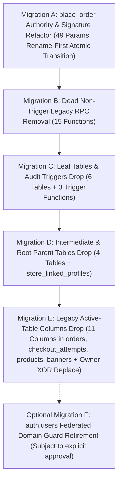

# DILMART — STAGE B PASS 2
# EXECUTIVE LEGACY AUTHORITY & DEPENDENCY CLOSURE PLAN

**Generated:** 2026-08-30 | **Updated:** 2026-08-31 (Micro-Closure Patch) | **Status:** PLANNING & AUDIT BASELINE (READ-ONLY)
**Authoritative Baseline Commit:** `355675694b7dc5899125a20b05920b11b95547ae` on `main`
**Target Supabase Project:** `ztplxqlthuqkuktbznbo` (DilMart-Store Live)
**Evidence Directory:** [`docs/stage-b/pass2/evidence/`](file:///d:/DilMart/docs/stage-b/pass2/evidence/)

---

## 1. Executive Summary & Core Verdicts

Stage B Pass 2 establishes the machine-verified, catalog-derived master plan for retiring the StylAi / Barber / Salon / Federated / Handoff / B2B legacy architecture from DILMART.
All findings are derived from direct inspection of the live PostgreSQL system catalogs (`pg_proc`, `pg_class`, `pg_attribute`, `pg_constraint`, `pg_trigger`, `aclexplode()`) and full repository static/runtime tracing.

### Key Metrics Summary

| Category | Total Identified | Safe to Remove (Dead) | Remove After Refactor (Blocked) | Retain / Active Authority | Review / Auth Guard / Defer |
| :--- | :---: | :---: | :---: | :---: | :---: |
| **Legacy Tables** | **11** | **11** (0 rows live) | 0 | 0 | 0 |
| **Legacy Columns (Active Tables)** | **11** | **8** (0 non-null) | **3** (in `orders`) | 0 | **1** (`products.is_b2b_offer`) |
| **Legacy / Checked Functions** | **21** | **18** (0 runtime callers) | **1** (`place_order`) | **1** (`place_order_idempotent`) | **1** (`reject_reserved_federated_email`) |
| **Non-Empty Tables** | **0** | — | — | — | 0 rows across all 11 tables |

---

## 2. Strategic Conclusions by Domain

### A. Active Checkout & Manual Orders: `place_order` (CRITICAL BLOCKER)
- `public.place_order` is **ACTIVELY REACHABLE** at runtime across two critical production surfaces:
  1. **Customer Checkout:** Called by `place_order_idempotent` (and fallback `CheckoutService.submit()`).
  2. **Assisted & Manual Orders:** Called directly by `OrdersService.createManualOrder()` (powers agent/manual and WhatsApp-assisted ordering).
- **Signature Transition:** Old signature has **55 parameters**; new clean signature has **49 parameters** (removing 6 legacy parameters: `p_source_app`, `p_store_linked_profile_id`, `p_dilmart_user_id`, `p_dilmart_barbershop_id`, `p_segment`, `p_business_type`).
- **Atomic Rename-First Transition:** Migration A will execute `ALTER FUNCTION ... RENAME TO place_order_legacy_stageb` ➔ `CREATE FUNCTION place_order (49 args)` ➔ `UPDATE place_order_idempotent` ➔ `DROP FUNCTION place_order_legacy_stageb RESTRICT` inside a single transaction to guarantee zero ambiguous overload state.

### B. `checkout_attempts` Domain & `chk_checkout_attempts_owner_xor`
- Constraint `chk_checkout_attempts_owner_xor` enforces XOR ownership between `user_id` and legacy `store_linked_profile_id` / `store_cart_id`.
- **Verdict:** Migration E must explicitly drop `chk_checkout_attempts_owner_xor` and replace it with a modern invariant check `CHECK (user_id IS NOT NULL)` before dropping `store_linked_profile_id` and `store_cart_id`.

### C. M28 Source Tracking Columns (`orders.source_app`, `orders.segment`, `orders.business_type`)
- Originating from `20260601120000_m28_orders_source_tracking.sql` for Barber B2B tracking.
- All three columns have **0 non-null rows** in production.
- `orders.channel` is already the modern authoritative channel field in DILMART.
- **Verdict:** Classified as **REMOVE** in Migration E along with their indexes (`idx_orders_source_app`, `idx_orders_segment`).

### D. `auth.users` Federated Email Guard (CROSS-SCHEMA DEPENDENCY)
- `public.reject_reserved_federated_email()` is attached as a trigger (`trg_reject_reserved_federated_email`) on `auth.users`.
- Live query confirms **0 users on reserved domains** and **0 users with federated metadata** in `auth.users`.
- **Verdict:** Classified as **REVIEW — AUTH SECURITY GUARD**. It is isolated to **Optional Migration F** subject to explicit separate authorization.

### E. Trigger Function Lifecycle (`RESTRICT` Rule)
- 3 audit trigger functions (`reject_barber_handoff_audit_mutation`, `reject_handoff_audit_mutation`, `reject_federated_session_audit_mutation`) are attached to audit tables.
- **Verdict:** Their parent audit tables and triggers must be dropped first in Migration C, followed immediately by dropping the unreferenced trigger functions under `RESTRICT`.

---

## 3. High-Level Future Migration Waves (6 Bounded Forward Migrations)

---

## 4. Absolute Safety & Governance Boundary

- **Pass 2 Status:** **READ-ONLY PLANNING**.
- **Production Status:** Zero DDL/DML executed. No migrations created or applied.
- **Next Step:** Await supervisor review and authorization before authoring Pass 3 execution migrations.
