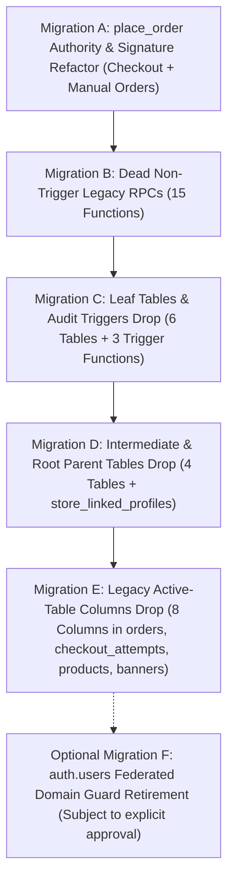

# DILMART — STAGE B PASS 2
# EXECUTIVE LEGACY AUTHORITY & DEPENDENCY CLOSURE PLAN

**Generated:** 2026-08-30 | **Updated:** 2026-08-31 | **Status:** PLANNING & AUDIT BASELINE (READ-ONLY)
**Authoritative Baseline Commit:** `355675694b7dc5899125a20b05920b11b95547ae` on `main`
**Target Supabase Project:** `ztplxqlthuqkuktbznbo` (DilMart-Store Live)
**Evidence Directory:** [`docs/stage-b/pass2/evidence/`](file:///d:/DilMart/docs/stage-b/pass2/evidence/)

---

## 1. Executive Summary & Core Verdicts

Stage B Pass 2 establishes the machine-verified, catalog-derived master plan for retiring the StylAi / Barber / Salon / Federated / Handoff / B2B legacy architecture from DILMART.
All findings in this plan are derived from direct inspection of the live PostgreSQL system catalogs (`pg_proc`, `pg_class`, `pg_attribute`, `pg_constraint`, `pg_trigger`, `aclexplode()`) and full repository static/runtime tracing.

### Key Metrics Summary

| Category | Total Identified | Safe to Remove (Dead) | Remove After Refactor (Blocked) | Retain / Active Authority | Review / Auth Guard / Defer |
| :--- | :---: | :---: | :---: | :---: | :---: |
| **Legacy Tables** | **11** | **11** (0 rows live) | 0 | 0 | 0 |
| **Legacy Columns** | **8** | **5** (0 non-null) | **3** (in `orders`) | 0 | **1** (`products.is_b2b_offer`) |
| **Legacy / Checked Functions** | **21** | **18** (0 runtime callers) | **1** (`place_order`) | **1** (`place_order_idempotent`) | **1** (`reject_reserved_federated_email`) |
| **Non-Empty Tables** | **0** | — | — | — | 0 rows across all 11 tables |

---

## 2. Strategic Conclusions by Domain

### A. Active Checkout & Manual Orders: `place_order` (CRITICAL BLOCKER)
- `public.place_order` is **ACTIVELY REACHABLE** at runtime across two critical production surfaces:
  1. **Customer Checkout:** Called by `place_order_idempotent` (and fallback `CheckoutService.submit()`).
  2. **Assisted & Manual Orders:** Called directly by `OrdersService.createManualOrder()` (powers agent/manual and WhatsApp-assisted ordering).
- Its current PostgreSQL function body references legacy parameters (`p_store_linked_profile_id`, `p_dilmart_user_id`, `p_dilmart_barbershop_id`, `p_segment`, `p_business_type`) and assigns them to columns in `public.orders`.
- **Verdict:** `public.place_order` **MUST NOT BE DROPPED**. It must be **REFACTORED in dedicated Migration A** to remove legacy parameter signatures and column writes before `orders` legacy columns can be dropped.

### B. `auth.users` Federated Email Guard (CROSS-SCHEMA DEPENDENCY)
- `public.reject_reserved_federated_email()` is attached as a trigger (`trg_reject_reserved_federated_email`) on `auth.users`.
- Live query confirms **0 users on reserved domains** and **0 users with federated metadata** in `auth.users`.
- **Verdict:** Classified as **REVIEW — AUTH SECURITY GUARD**. It must NOT be bundled into generic dead-RPC cleanup and should either be retained or retired in an explicitly authorized auth migration.

### C. Trigger Function Lifecycle (`RESTRICT` Rule)
- 3 audit trigger functions (`reject_barber_handoff_audit_mutation`, `reject_handoff_audit_mutation`, `reject_federated_session_audit_mutation`) are attached to audit tables.
- **Verdict:** Under PostgreSQL `RESTRICT` rules, these trigger functions CANNOT be dropped in Wave 1. Their parent audit tables and triggers must be dropped first in Migration C, followed immediately by dropping the unreferenced trigger functions.

### D. `checkout_attempts` Domain
- `checkout_attempts.store_cart_id` and `checkout_attempts.store_linked_profile_id` have 0 non-null rows in production, 0 references in `place_order_idempotent`, 0 callers in backend NestJS, and 0 callers in frontend.
- **Verdict:** **SAFE TO REMOVE** in Migration E after dropping their foreign key constraints and indexes.

### E. Store Cart Domain (`store_carts`, `store_cart_items`)
- Dedicated to the obsolete Barber B2B order model. Replaced entirely by client-side cart + atomic checkout lines in modern DILMART.
- Live row counts: `store_carts` = 0, `store_cart_items` = 0.
- **Verdict:** **SAFE TO REMOVE** in Migration C (leaf `store_cart_items`) and Migration D (parent `store_carts`).

### F. Linked Profile Domain (`store_linked_profiles`)
- Central hub of the former StylAi Barber bridge. Replaced by direct Supabase Auth `profiles` in modern DILMART.
- Live row count: `store_linked_profiles` = 0.
- **Verdict:** **SAFE TO REMOVE** in Migration D (as the root table after all child FKs are dropped).

---

## 3. High-Level Future Migration Waves (6 Bounded Forward Migrations)

---

## 4. Absolute Safety & Governance Boundary

- **Pass 2 Status:** **READ-ONLY PLANNING**.
- **Production Status:** Zero DDL/DML executed. No migrations created or applied.
- **Next Step:** Await supervisor review and authorization before authoring Pass 3 execution migrations.
