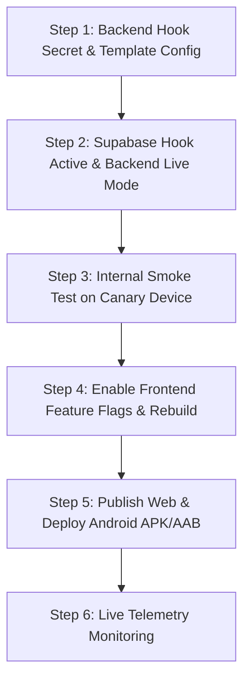

# Dark Launch & Instant Rollback Runbook — WhatsApp OTP Auth
**Task ID**: `DILMART-CUSTOMER-WHATSAPP-OTP-AUTH-007`  
**System**: Customer Authentication & Onboarding

---

## 1. Principles
- **Dark Launch**: All code deployed to production with flags disabled (`false` / `disabled`). Zero customer-facing changes occur until activation.
- **Fail-Closed**: If credentials, network, or Meta fail, requests fail-closed without leaking user existence or leaving half-authenticated sessions.
- **Instant Rollback**: Any anomaly triggers an immediate flag toggle to restore legacy password/email login in under 60 seconds without code revert.

---

## 2. Activation Sequence (When Authorized)



### Step 1: Backend Deployment
1. Set Render environment variables:
   ```env
   OTP_WHATSAPP_MODE=sandbox
   OTP_WHATSAPP_PHONE_NUMBER_ID=<meta_phone_number_id>
   OTP_WHATSAPP_ACCESS_TOKEN=<system_user_token>
   OTP_WHATSAPP_TEMPLATE_NAME=<approved_template_name>
   OTP_WHATSAPP_TEMPLATE_TYPE=<matching_template_type>
   OTP_WHATSAPP_TEMPLATE_LANGUAGE=<matching_language_code>
   OTP_WHATSAPP_DAILY_GLOBAL_LIMIT=200
   OTP_WHATSAPP_DAILY_LIMIT_TIMEZONE=Asia/Baghdad
   SUPABASE_AUTH_HOOK_SECRET=<secret_key>
   ```
2. Deploy backend service and verify `/api/health`.

### Step 2: Supabase Hook Configuration
1. In Supabase Dashboard (`ztplxqlthuqkuktbznbo`), enable Send SMS Hook pointing to backend:
   `https://dilmart-store-backend.onrender.com/api/auth/hooks/supabase/send-sms`

### Step 3: Canary Test
1. Using an internal test phone (`07XXXXXXXXX`), request OTP.
2. Confirm WhatsApp message delivery and token verification.

### Step 4 & 5: Frontend Build & Release
1. Update frontend build flags:
   ```env
   VITE_AUTH_PHONE_OTP_ENABLED=true
   VITE_AUTH_PHONE_REGISTRATION_ENABLED=true
   ```
2. Build web bundle: `npm run build`.
3. Build Android release: `npm run build:mobile && npx cap sync android && cd android && ./gradlew bundleRelease`.
4. Deploy web and distribute Android package.

---

## 3. Instant Rollback Procedure

If Meta API reports outages, delivery failures exceed 5%, or unexpected behavior occurs:

### Instant Rollback Option A: Backend Kill-Switch (Immediate, < 30 seconds)
1. Go to **Render Dashboard** -> **dilmart-backend** -> **Environment**.
2. Set:
   ```env
   OTP_WHATSAPP_MODE=disabled
   ```
3. Save changes. Backend automatically redeploys in ~30 seconds.
4. **Effect**: Backend immediately rejects all hook dispatches fail-closed. No further Meta API calls are made.

### Instant Rollback Option B: Supabase Hook Toggle (Immediate, < 60 seconds)
1. Go to **Supabase Dashboard** -> **Authentication** -> **Hooks**.
2. Disable the **Send SMS Hook**.
3. **Effect**: Supabase stops sending webhook dispatches to the backend.

### Instant Rollback Option C: Frontend Web Revert
1. Set `VITE_AUTH_PHONE_OTP_ENABLED=false` and `VITE_AUTH_PHONE_REGISTRATION_ENABLED=false`.
2. Redeploy frontend.
3. **Effect**: Web and mobile interfaces immediately return to the legacy Email/Password interface. Legacy passwords and accounts remain 100% intact.
