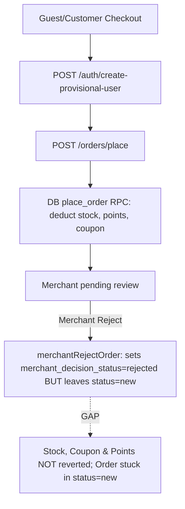

# Launch Critical Flows Baseline Report

**Date:** 2026-07-24  
**Repository:** `cylendralabs-blip/DilMart-Store` (`e:\Project\DilMart-Store`)  
**Base Commit:** `3a40ee149ecde67a04e6342f3da70214990a1afe`  
**Target Branch:** `main`

---

## 1. Initial Verification Results

| Target           | Command                                 | Result  | Details                      |
| ---------------- | --------------------------------------- | ------- | ---------------------------- |
| Root Frontend    | `npm run build`                         | 🟢 PASS | Built dist in 23.96s         |
| Arch Guard       | `npm run arch:guard`                    | 🟢 PASS | 0 direct Supabase violations |
| Backend App      | `cd backend && npm run build`           | 🟢 PASS | NestJS build clean           |
| Policy Tests     | `cd backend && npm run test:policy`     | 🟢 PASS | 23/23 tests pass             |
| Hardening Tests  | `cd backend && npm run test:hardening`  | 🟢 PASS | 39/39 tests pass             |
| Commercial Tests | `cd backend && npm run test:commercial` | 🟢 PASS | 6/6 tests pass               |

---

## 2. Relevant Existing Files & Services

### PR-1: Account Claim & Recovery

- `backend/src/modules/auth/auth.service.ts`
- `backend/src/modules/auth/auth.controller.ts`
- `backend/src/modules/auth/create-provisional-user.dto.ts`
- `src/lib/api/customer.ts`
- `src/pages/Checkout.tsx`

### PR-2: Atomic Cancellation & Merchant Rejection

- `backend/src/modules/orders/orders.service.ts` (`merchantRejectOrder`)
- `backend/src/modules/orders/orders.controller.ts`
- `supabase/migrations/*_place_order.sql` (stock deduction & loyalty)
- `src/pages/merchant/OrderDetail.tsx`
- `src/components/merchant/MerchantDecisionModal.tsx`

### PR-3: Checkout Idempotency & Post-Checkout Reliability

- `backend/src/modules/orders/dto/checkout-submit.dto.ts`
- `supabase/migrations/*_place_order.sql`
- `src/pages/Checkout.tsx`
- `src/lib/api/checkout.ts`

### PR-4: Customer Cancellation & Return Requests

- `backend/src/modules/customer/customer.controller.ts`
- `backend/src/modules/customer/customer.service.ts`
- `src/pages/account/Orders.tsx`

---

## 3. Current Checkout & Cancellation Lifecycle Overview

---

## 4. Work Breakdown Strategy (4 Sequential PRs)

- **PR-1:** Account Claim, Phone Verification and Password Recovery
- **PR-2:** Atomic Cancellation Engine and Merchant Rejection Completion
- **PR-3:** Checkout Idempotency and Post-Checkout Reliability
- **PR-4:** Customer Cancellation and Return Requests
