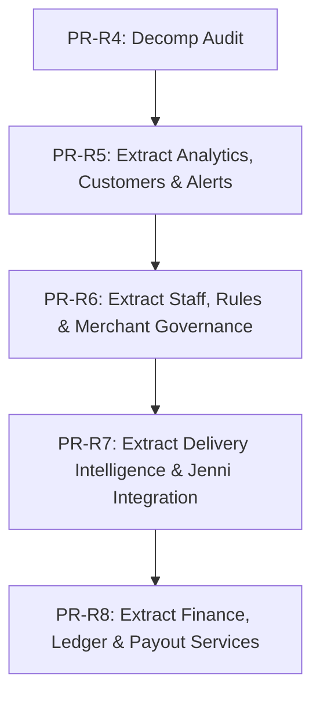

# Design & Audit Report — Phase R4: AdminService Decomposition Audit

**Date:** 2026-07-02  
**Phase:** Phase R4 — AdminService Decomposition Audit  
**Status:** COMPLETE  

---

## 1. Executive Summary
The `AdminService` class in `admin.service.ts` is currently a monolithic service containing 2,179 lines of code, injecting 17 constructor dependencies, and exposing over 70 public/private methods. It spans multiple distinct functional domains, including analytics, customer operations, merchant management, staff/agent management, commercial policy/pricing rules, financial/ledger operations, and shipping/dispatch integrations (Jenni).

Decomposing this service is crucial for the following reasons:
- **Maintainability**: Reduced file size and clean separation of concerns.
- **Dependency Isolation**: Removing unused dependencies from specific domain scopes (e.g., shipping dependencies should not compile with finance logic).
- **Testability**: Clear boundaries facilitate localized mock tests and regression verification.

This audit establishes the logical domain boundaries, risk-ranked extractions, and dependency maps to guide subsequent decomposition phases safely.

---

## 2. Constructor Dependency Map

The following map defines all 17 dependencies injected into `AdminService` and their corresponding consumers:

| Dependency | Class Type | Used By (Methods / Domain Areas) |
| :--- | :--- | :--- |
| `supabaseAdmin` | `SupabaseAdminService` | Almost all methods (CRUD operations, RPC invocations) |
| `auditService` | `AuditService` | All mutation methods (logging admin actions) |
| `orderFinanceService` | `OrderFinanceService` | Financial adjustments, remittance, disputing, and collections |
| `courierFinanceService` | `CourierFinanceService` | Courier payouts, ledgers, and disputes |
| `merchantsService` | `MerchantsService` | Merchant readiness checks, platforms health summaries |
| `notificationsService` | `NotificationsService` | Fanout of operational alerts and push notifications |
| `deliveryOperationsService` | `DeliveryOperationsService` | Listing delivery operations, tracking active courier runs |
| `deliveryIntelligenceService` | `DeliveryIntelligenceService` | Intelligence queue, route analysis, courier delay analysis |
| `jenniDispatchService` | `JenniDispatchService` | Order dispatching to external Jenni delivery API |
| `jenniSyncService` | `JenniSyncService` | Syncing shipping statuses and webhook ingestion |
| `jenniReferenceSyncService` | `JenniReferenceSyncService` | Reference data updates (governorates, delivery areas) |
| `jenniStoreProvisioningService` | `JenniStoreProvisioningService`| Registering stores on Jenni, synchronizing store metadata |
| `jenniMerchantProvisioningService`| `JenniMerchantProvisioningService`| Registering merchants, synchronizing merchant IDs |
| `jenniAuthService` | `JenniAuthService` | Connection diagnostics and credential validation |
| `jenniClientService` | `JenniClientService` | Connection diagnostics and endpoint connectivity tests |
| `configService` | `ConfigService` | Checking feature flags for diagnostics and provisioning |
| `scopeResolver` | `ScopeResolverService` | Resolving merchant scopes and verifying merchant ownership |

---

## 3. Logical Domain Buckets

Based on the actual methods in `AdminService`, we propose decomposing it into the following 8 candidate services:

### 1. `AdminAnalyticsService`
- Exposes metrics dashboards and weekly throughput summaries.
- **Methods**: `getAnalyticsOverview`, `getExecutiveGovernance`.

### 2. `AdminCustomersService`
- Handles administrative access to customer directories.
- **Methods**: `getScopedCustomers`.

### 3. `AdminStaffService`
- Manages platform agents, delivery staff, and operational permissions.
- **Methods**: `listAgentsWithStats`, `createAgent`, `revokeAgent`.

### 4. `AdminOperationalAlertsService`
- Governs administrative notifications, system tasks, and operational alerts.
- **Methods**: `maybeFanoutOperationalAlerts`, `computeOperationalAlerts`, `listAdminNotifications`, `markAdminNotificationRead`, `markAllAdminNotificationsRead`, `listGovernanceTasks`, `upsertGovernanceTask`, `listDesktopQuickLinks`, `createDesktopQuickLink`, `updateDesktopQuickLink`, `deleteDesktopQuickLink`.

### 5. `AdminCommercialPolicyService`
- Oversees commercial condition templates, discount caps, coupon settings, and pricing rules.
- **Methods**: `getCommercialPolicyProfile`, `getCommercialPolicyAssignment`, `upsertCommercialPolicyAssignment`, `getLoyaltySettings`, `updateLoyaltySettings`, `validateCommercialRuleRow`, `listCommercialRules`, `createCommercialRule`, `updateCommercialRule`, `setCommercialRuleActive`.

### 6. `AdminFinanceService`
- Controls ledger posting, manual balance adjustments, payout batches, and remittance states.
- **Methods**: `getOrderFinancialDetail`, `listMerchantLedgerEntries`, `createPayoutBatch`, `approvePayoutBatch`, `settlePayoutBatch`, `listMerchantPayoutBatches`, `createCourierPayoutBatch`, `listCourierPayoutBatches`, `getCourierPayoutBatchDetail`, `approveCourierPayoutBatch`, `settleCourierPayoutBatch`, `cancelCourierPayoutBatch`, `listCourierLedgerEntries`, `createCourierManualAdjustment`, `reverseCourierLedgerEntry`, `releaseOrderCourierDispute`, `getFinancialReconciliationOrders`, `getFinancialMerchantBalances`, `getFinancialCourierPayables`, `getFinancialCourierReconciliationOrders`, `getFinancialCourierCodSummary`, `collectionStatusRank`, `appendCollectionEvent`, `markOrderCashCollected`, `markOrderRemittedToPlatform`, `markOrderRemittedToMerchant`, `settleOrderCourier`, `markOrderFinanceDisputed`, `listOrderCollectionEvents`, `createManualAdjustment`, `reverseFinanceEntry`, `listOrderFinanceEvents`.

### 7. `AdminDeliveryIntelligenceService`
- Exposes shipping status synchronization, manual courier updates, and route analytics.
- **Methods**: `normalizeDeliveryStatus`, `getOrderJenniIntegration`, `dispatchOrderToJenni`, `syncOrderFromJenni`, `syncJenniReferenceData`, `assignOrderToDeliveryCompany`, `assignOrderToAgent`, `markOrderDeliveryPickedUp`, `markOrderDeliveryInTransit`, `markOrderDeliveryDelivered`, `markOrderDeliveryFailed`, `markOrderReturned`, `markOrderDeliveryCancelled`, `addOrderDeliveryNote`, `listOrderDeliveryEvents`, `listDeliveryOperations`, `listDeliveryIntelligenceQueue`, `getOrderDeliveryIntelligence`, `listOutboundDispatchAttempts`, `getOutboundDiagnostics`, `replayOutboundDispatch`, `listDeadLetters`, `transitionDeadLetter`, `diagnoseJenniConnection`.

### 8. `AdminMerchantGovernanceService`
- Governs merchant subscription plans, store linkages, and logistics platform registrations.
- **Methods**: `listMerchantPlans`, `createMerchantPlan`, `updateMerchantPlan`, `createMerchantPlanAssignment`, `listMerchantPlanAssignments`, `updateMerchantPlanAssignment`, `getJenniProvisioningStatus`, `assertProvisioningEnabled`, `assertMerchantProvisioningEnabled`, `createJenniMerchant`, `createJenniStore`, `linkJenniStore`.

---

## 4. Method Inventory

The complete inventory of all methods inside `AdminService`:

| Method Name | Responsibility | Domain Bucket | Dependencies | Tables/RPCs Touched | Auth/Scope | Risk | Target Service |
| :--- | :--- | :--- | :--- | :--- | :--- | :--- | :--- |
| `getAnalyticsOverview` | Retrieves sales metrics | `AdminAnalyticsService` | `supabaseAdmin` | RPC `analytics_overview` | Admin/Super | **Low** | `AdminAnalyticsService` |
| `getExecutiveGovernance` | Delayed order risk & readiness | `AdminAnalyticsService` | `supabaseAdmin`, `merchantsService` | RPC `executive_governance_metrics` | Admin/Super | **Low** | `AdminAnalyticsService` |
| `getScopedCustomers` | Admin customer directory | `AdminCustomersService` | `supabaseAdmin` | RPC `merchant_customer_summary` | Merchant/Admin | **Low** | `AdminCustomersService` |
| `listAgentsWithStats` | Lists agents with KPIs | `AdminStaffService` | `supabaseAdmin` | `profiles` | Admin/Super | **Low** | `AdminStaffService` |
| `createAgent` | Creates a platform agent | `AdminStaffService` | `supabaseAdmin`, `auditService` | `profiles` | Admin/Super | **Medium**| `AdminStaffService` |
| `revokeAgent` | Deactivates a platform agent | `AdminStaffService` | `supabaseAdmin`, `auditService` | `profiles` | Admin/Super | **Medium**| `AdminStaffService` |
| `getLoyaltySettings` | Fetches system reward caps | `AdminCommercialPolicy` | `supabaseAdmin` | `loyalty_settings` | Admin/Super | **Low** | `AdminCommercialPolicy` |
| `updateLoyaltySettings` | Modifies reward caps | `AdminCommercialPolicy` | `supabaseAdmin`, `auditService` | `loyalty_settings` | Admin/Super | **Medium**| `AdminCommercialPolicy` |
| `listAdminNotifications` | Lists alerts | `AdminOperationalAlerts` | `supabaseAdmin` | `admin_notifications` | Admin/Super | **Low** | `AdminOperationalAlerts` |
| `computeOperationalAlerts`| Analyzes active risk states | `AdminOperationalAlerts` | `supabaseAdmin` | `orders`, `merchant_readiness` | System/Cron | **Medium**| `AdminOperationalAlerts` |
| `markAdminNotificationRead`| Marks alert read | `AdminOperationalAlerts` | `supabaseAdmin`, `auditService` | `admin_notifications` | Admin/Super | **Low** | `AdminOperationalAlerts` |
| `markAllAdminNotificationsRead`| Marks all alerts read | `AdminOperationalAlerts` | `supabaseAdmin`, `auditService` | `admin_notifications` | Admin/Super | **Low** | `AdminOperationalAlerts` |
| `listGovernanceTasks` | Lists tasks | `AdminOperationalAlerts` | `supabaseAdmin` | `governance_tasks` | Admin/Super | **Low** | `AdminOperationalAlerts` |
| `upsertGovernanceTask` | Upserts task | `AdminOperationalAlerts` | `supabaseAdmin`, `auditService` | `governance_tasks` | Admin/Super | **Medium**| `AdminOperationalAlerts` |
| `getCommercialPolicyAssignment`| Fetches rule profile | `AdminCommercialPolicy` | `supabaseAdmin`, `scopeResolver`| `commercial_policy_assignments` | Multi-role | **Low** | `AdminCommercialPolicy` |
| `upsertCommercialPolicyAssignment`| Assigns rule profile | `AdminCommercialPolicy` | `supabaseAdmin`, `auditService` | `commercial_policy_assignments` | Admin/Super | **Medium**| `AdminCommercialPolicy` |
| `getOrderFinancialDetail` | Financial summaries | `AdminFinanceService` | `orderFinanceService` | N/A | Admin/Super | **Medium**| `AdminFinanceService` |
| `listMerchantLedgerEntries`| Lists payouts/ledger | `AdminFinanceService` | `supabaseAdmin` | `merchant_ledger` | Admin/Super | **Medium**| `AdminFinanceService` |
| `createPayoutBatch` | Bundles payouts | `AdminFinanceService` | `supabaseAdmin` | `payout_batches` | Admin/Super | **High** | `AdminFinanceService` |
| `approvePayoutBatch` | Authorizes batch | `AdminFinanceService` | `supabaseAdmin`, `auditService` | `payout_batches` | Admin/Super | **High** | `AdminFinanceService` |
| `settlePayoutBatch` | Post batch to ledger | `AdminFinanceService` | `supabaseAdmin`, `auditService` | `payout_batches`, `merchant_ledger`| Admin/Super | **High** | `AdminFinanceService` |
| `listMerchantPayoutBatches`| Lists merchant payouts | `AdminFinanceService` | `supabaseAdmin` | `payout_batches` | Admin/Super | **Medium**| `AdminFinanceService` |
| `createCourierPayoutBatch`| Bundles courier payout | `AdminFinanceService` | `supabaseAdmin` | `courier_payout_batches` | Admin/Super | **High** | `AdminFinanceService` |
| `listCourierPayoutBatches`| Lists courier payouts | `AdminFinanceService` | `supabaseAdmin` | `courier_payout_batches` | Admin/Super | **Medium**| `AdminFinanceService` |
| `getCourierPayoutBatchDetail`| Detail for courier payout | `AdminFinanceService` | `supabaseAdmin` | `courier_payout_batches` | Admin/Super | **Medium**| `AdminFinanceService` |
| `approveCourierPayoutBatch`| Authorizes courier batch | `AdminFinanceService` | `courierFinanceService`, `auditService`| `courier_payout_batches` | Admin/Super | **High** | `AdminFinanceService` |
| `settleCourierPayoutBatch` | Settle courier batch | `AdminFinanceService` | `courierFinanceService`, `auditService`| `courier_payout_batches` | Admin/Super | **High** | `AdminFinanceService` |
| `cancelCourierPayoutBatch`| Cancels courier batch | `AdminFinanceService` | `courierFinanceService`, `auditService`| `courier_payout_batches` | Admin/Super | **High** | `AdminFinanceService` |
| `listCourierLedgerEntries`| Lists courier ledger | `AdminFinanceService` | `supabaseAdmin` | `courier_ledger` | Admin/Super | **Medium**| `AdminFinanceService` |
| `createCourierManualAdjustment`| Manual adjustment | `AdminFinanceService` | `courierFinanceService`, `auditService`| `courier_ledger` | Admin/Super | **High** | `AdminFinanceService` |
| `reverseCourierLedgerEntry`| Reverses adjustment | `AdminFinanceService` | `courierFinanceService`, `auditService`| `courier_ledger` | Admin/Super | **High** | `AdminFinanceService` |
| `releaseOrderCourierDispute`| Releases dispute | `AdminFinanceService` | `supabaseAdmin`, `auditService` | `orders` | Admin/Super | **High** | `AdminFinanceService` |
| `getFinancialReconciliationOrders`| Lists COD orders | `AdminFinanceService` | `supabaseAdmin` | `orders` | Admin/Super | **Medium**| `AdminFinanceService` |
| `getFinancialMerchantBalances`| Balance lists | `AdminFinanceService` | `supabaseAdmin` | RPC `get_merchant_balances` | Admin/Super | **Medium**| `AdminFinanceService` |
| `getFinancialCourierPayables`| Payables lists | `AdminFinanceService` | `supabaseAdmin` | RPC `get_courier_payables` | Admin/Super | **Medium**| `AdminFinanceService` |
| `getFinancialCourierReconciliationOrders`| Lists delivery recon | `AdminFinanceService` | `supabaseAdmin` | `orders` | Admin/Super | **Medium**| `AdminFinanceService` |
| `getFinancialCourierCodSummary`| Summarizes courier COD | `AdminFinanceService` | `supabaseAdmin` | `orders` | Admin/Super | **Medium**| `AdminFinanceService` |
| `markOrderCashCollected`| Sets order cash collected | `AdminFinanceService` | `supabaseAdmin`, `auditService`, `orderFinanceService`| `orders`, `order_collection_events` | Admin/Super | **High** | `AdminFinanceService` |
| `markOrderRemittedToPlatform`| Sets order remitted | `AdminFinanceService` | `supabaseAdmin`, `auditService`, `orderFinanceService`| `orders`, `order_collection_events` | Admin/Super | **High** | `AdminFinanceService` |
| `markOrderRemittedToMerchant`| Remits order cash to merchant | `AdminFinanceService` | `supabaseAdmin`, `auditService`, `orderFinanceService`| `orders`, `order_collection_events` | Admin/Super | **High** | `AdminFinanceService` |
| `settleOrderCourier` | Posts courier earnings | `AdminFinanceService` | `supabaseAdmin`, `auditService`, `orderFinanceService`| `orders`, `courier_ledger` | Admin/Super | **High** | `AdminFinanceService` |
| `markOrderFinanceDisputed`| Disputes order finances | `AdminFinanceService` | `supabaseAdmin`, `auditService`, `orderFinanceService`| `orders`, `order_finance_events` | Admin/Super | **High** | `AdminFinanceService` |
| `listOrderCollectionEvents`| Lists collection events | `AdminFinanceService` | `supabaseAdmin` | `order_collection_events` | Admin/Super | **Medium**| `AdminFinanceService` |
| `getOrderJenniIntegration`| Integration info | `AdminDeliveryIntelligence`| `jenniSyncService` | `jenni_order_sync_status` | Admin/Super | **Medium**| `AdminDeliveryIntelligence`|
| `dispatchOrderToJenni` | Dispatches order to Jenni | `AdminDeliveryIntelligence`| `jenniDispatchService`, `auditService` | `jenni_order_sync_status` | Admin/Super | **High** | `AdminDeliveryIntelligence`|
| `syncOrderFromJenni` | Webhook status sync | `AdminDeliveryIntelligence`| `jenniSyncService` | `jenni_order_sync_status` | Webhook | **High** | `AdminDeliveryIntelligence`|
| `syncJenniReferenceData`| Syncs reference tables | `AdminDeliveryIntelligence`| `jenniReferenceSyncService` | `governorates`, `delivery_areas` | Admin/Super | **High** | `AdminDeliveryIntelligence`|
| `assignOrderToDeliveryCompany`| Assigns courier | `AdminDeliveryIntelligence`| `supabaseAdmin`, `auditService` | `orders` | Admin/Super | **High** | `AdminDeliveryIntelligence`|
| `assignOrderToAgent` | Assigns agent | `AdminDeliveryIntelligence`| `supabaseAdmin`, `auditService` | `orders` | Admin/Super | **High** | `AdminDeliveryIntelligence`|
| `markOrderDeliveryPickedUp`| Sets order status to picked up| `AdminDeliveryIntelligence`| `supabaseAdmin`, `auditService` | `orders`, `deliveries` | Admin/Super | **High** | `AdminDeliveryIntelligence`|
| `markOrderDeliveryInTransit`| Sets order status in transit| `AdminDeliveryIntelligence`| `supabaseAdmin`, `auditService` | `orders`, `deliveries` | Admin/Super | **High** | `AdminDeliveryIntelligence`|
| `markOrderDeliveryDelivered`| Sets order status delivered | `AdminDeliveryIntelligence`| `supabaseAdmin`, `auditService` | `orders`, `deliveries` | Admin/Super | **High** | `AdminDeliveryIntelligence`|
| `markOrderDeliveryFailed` | Sets order status failed | `AdminDeliveryIntelligence`| `supabaseAdmin`, `auditService` | `orders`, `deliveries` | Admin/Super | **High** | `AdminDeliveryIntelligence`|
| `markOrderReturned` | Sets order status returned | `AdminDeliveryIntelligence`| `supabaseAdmin`, `auditService` | `orders`, `deliveries` | Admin/Super | **High** | `AdminDeliveryIntelligence`|
| `markOrderDeliveryCancelled`| Sets order status cancelled | `AdminDeliveryIntelligence`| `supabaseAdmin`, `auditService` | `orders`, `deliveries` | Admin/Super | **High** | `AdminDeliveryIntelligence`|
| `addOrderDeliveryNote` | Appends delivery note | `AdminDeliveryIntelligence`| `supabaseAdmin`, `auditService` | `deliveries` | Admin/Super | **Medium**| `AdminDeliveryIntelligence`|
| `listOrderDeliveryEvents` | Lists delivery history | `AdminDeliveryIntelligence`| `supabaseAdmin` | `deliveries` | Admin/Super | **Medium**| `AdminDeliveryIntelligence`|
| `listDeliveryOperations` | Displays active shipments | `AdminDeliveryIntelligence`| `deliveryOperationsService` | N/A | Admin/Super | **Medium**| `AdminDeliveryIntelligence`|
| `listDeliveryIntelligenceQueue`| Lists pending items | `AdminDeliveryIntelligence`| `deliveryIntelligenceService`| N/A | Admin/Super | **Medium**| `AdminDeliveryIntelligence`|
| `getOrderDeliveryIntelligence`| Analyzes shipping delays | `AdminDeliveryIntelligence`| `deliveryIntelligenceService`| N/A | Admin/Super | **Medium**| `AdminDeliveryIntelligence`|
| `createManualAdjustment` | Directly changes ledger | `AdminFinanceService` | `supabaseAdmin`, `auditService`, `orderFinanceService`| `merchant_ledger` | Admin/Super | **High** | `AdminFinanceService` |
| `reverseFinanceEntry` | Reverses ledger changes | `AdminFinanceService` | `supabaseAdmin`, `auditService`, `orderFinanceService`| `merchant_ledger` | Admin/Super | **High** | `AdminFinanceService` |
| `listOrderFinanceEvents` | Lists financial steps | `AdminFinanceService` | `supabaseAdmin` | `order_finance_events` | Admin/Super | **Medium**| `AdminFinanceService` |
| `listOutboundDispatchAttempts`| Lists outbound api checks | `AdminDeliveryIntelligence`| `supabaseAdmin` | `outbound_dispatch` | Admin/Super | **Medium**| `AdminDeliveryIntelligence`|
| `getOutboundDiagnostics` | Lists error logs | `AdminDeliveryIntelligence`| `supabaseAdmin` | `outbound_dispatch` | Admin/Super | **Medium**| `AdminDeliveryIntelligence`|
| `replayOutboundDispatch` | Re-sends hook payload | `AdminDeliveryIntelligence`| `supabaseAdmin`, `auditService` | `outbound_dispatch` | Admin/Super | **High** | `AdminDeliveryIntelligence`|
| `listDeadLetters` | Lists failed async events | `AdminDeliveryIntelligence`| `supabaseAdmin` | `dead_letters` | Admin/Super | **Medium**| `AdminDeliveryIntelligence`|
| `transitionDeadLetter` | Retries dead letter | `AdminDeliveryIntelligence`| `supabaseAdmin`, `auditService` | `dead_letters` | Admin/Super | **High** | `AdminDeliveryIntelligence`|
| `listMerchantPlans` | Lists plan tiers | `AdminMerchantGovernance` | `supabaseAdmin` | `merchant_plans` | Admin/Super | **Low** | `AdminMerchantGovernance` |
| `createMerchantPlan` | Creates plan tier | `AdminMerchantGovernance` | `supabaseAdmin`, `auditService` | `merchant_plans` | Admin/Super | **Medium**| `AdminMerchantGovernance` |
| `updateMerchantPlan` | Updates plan tier | `AdminMerchantGovernance` | `supabaseAdmin`, `auditService` | `merchant_plans` | Admin/Super | **Medium**| `AdminMerchantGovernance` |
| `createMerchantPlanAssignment`| Subscribes merchant | `AdminMerchantGovernance` | `supabaseAdmin`, `auditService` | `merchant_plan_assignments`| Admin/Super | **Medium**| `AdminMerchantGovernance` |
| `listMerchantPlanAssignments`| Lists active sub subscriptions| `AdminMerchantGovernance` | `supabaseAdmin` | `merchant_plan_assignments`| Admin/Super | **Low** | `AdminMerchantGovernance` |
| `updateMerchantPlanAssignment`| Cancels/modifies assignment | `AdminMerchantGovernance` | `supabaseAdmin`, `auditService` | `merchant_plan_assignments`| Admin/Super | **Medium**| `AdminMerchantGovernance` |
| `listCommercialRules` | Lists commercial rules | `AdminCommercialPolicy` | `supabaseAdmin` | `commercial_rules` | Admin/Super | **Low** | `AdminCommercialPolicy` |
| `createCommercialRule` | Creates commercial rule | `AdminCommercialPolicy` | `supabaseAdmin`, `auditService` | `commercial_rules` | Admin/Super | **Medium**| `AdminCommercialPolicy` |
| `updateCommercialRule` | Updates commercial rule | `AdminCommercialPolicy` | `supabaseAdmin`, `auditService` | `commercial_rules` | Admin/Super | **Medium**| `AdminCommercialPolicy` |
| `setCommercialRuleActive` | Activates commercial rule | `AdminCommercialPolicy` | `supabaseAdmin`, `auditService` | `commercial_rules` | Admin/Super | **Medium**| `AdminCommercialPolicy` |
| `listDesktopQuickLinks` | Lists admin links | `AdminOperationalAlerts` | `supabaseAdmin` | `desktop_quick_links` | Admin/Super | **Low** | `AdminOperationalAlerts` |
| `createDesktopQuickLink` | Creates link | `AdminOperationalAlerts` | `supabaseAdmin`, `auditService` | `desktop_quick_links` | Admin/Super | **Medium**| `AdminOperationalAlerts` |
| `updateDesktopQuickLink` | Updates link | `AdminOperationalAlerts` | `supabaseAdmin`, `auditService` | `desktop_quick_links` | Admin/Super | **Medium**| `AdminOperationalAlerts` |
| `deleteDesktopQuickLink` | Deletes link | `AdminOperationalAlerts` | `supabaseAdmin`, `auditService` | `desktop_quick_links` | Admin/Super | **Medium**| `AdminOperationalAlerts` |
| `getJenniProvisioningStatus`| Provisions detail | `AdminMerchantGovernance` | `jenniStoreProvisioningService`, `jenniMerchantProvisioningService`| N/A | Admin/Super | **Medium**| `AdminMerchantGovernance` |
| `createJenniMerchant` | Registers merchant on Jenni | `AdminMerchantGovernance` | `jenniMerchantProvisioningService`, `auditService`| `merchants` | Admin/Super | **High** | `AdminMerchantGovernance` |
| `createJenniStore` | Registers store on Jenni | `AdminMerchantGovernance` | `jenniStoreProvisioningService`, `auditService`| `merchants` | Admin/Super | **High** | `AdminMerchantGovernance` |
| `linkJenniStore` | Manually stores linking | `AdminMerchantGovernance` | `jenniStoreProvisioningService`, `auditService`| `merchants` | Admin/Super | **High** | `AdminMerchantGovernance` |
| `diagnoseJenniConnection` | Tests Jenni connectivity | `AdminDeliveryIntelligence`| `jenniAuthService`, `jenniClientService`, `configService`| N/A | Admin/Super | **Medium**| `AdminDeliveryIntelligence`|

---

## 5. Data Access Map

The following map catalogs all tables and RPCs accessed by `AdminService` and groups them by mutation type and sensitivity:

| Table / RPC Name | Access Type | Classification / Sensitivity |
| :--- | :--- | :--- |
| `analytics_overview` (RPC) | Read-only | Platform aggregated metrics (Low risk) |
| `executive_governance_metrics` (RPC) | Read-only | Operations overview (Low risk) |
| `merchant_customer_summary` (RPC) | Read-only | **Customer data exposure risk** (Medium sensitivity) |
| `get_merchant_balances` (RPC) | Read-only | Finance-adjacent (Medium sensitivity) |
| `get_courier_payables` (RPC) | Read-only | Finance-adjacent (Medium sensitivity) |
| `profiles` | Mutation | **Customer data exposure risk** (Staff credentials) |
| `admin_notifications` | Mutation | Alerts data (Low risk) |
| `governance_tasks` | Mutation | Operation state (Low risk) |
| `desktop_quick_links` | Mutation | Operations UI data (Low risk) |
| `loyalty_settings` | Mutation | Commercial configurations (Low risk) |
| `commercial_policy_assignments` | Mutation | Merchant condition routing (Merchant-scope sensitive) |
| `commercial_rules` | Mutation | Merchant conditions & pricing constraints (Merchant-scope sensitive) |
| `merchant_plans` | Mutation | Platform billing configurations (Low risk) |
| `merchant_plan_assignments` | Mutation | Merchant subscription levels (Merchant-scope sensitive) |
| `merchants` | Mutation | Core merchant registrations (Merchant-scope sensitive) |
| `orders` | Mutation | Operations, **Customer data exposure risk** (High sensitivity) |
| `deliveries` | Mutation | Shipping operations (High sensitivity) |
| `outbound_dispatch` | Mutation | Shipping dispatch statuses (Jenni-adjacent) |
| `dead_letters` | Mutation | System queues (Jenni-adjacent) |
| `jenni_order_sync_status` | Mutation | Shipping dispatch statuses (Jenni-adjacent) |
| `governorates` | Mutation | Jenni-adjacent metadata (Low risk) |
| `delivery_areas` | Mutation | Jenni-adjacent metadata (Low risk) |
| `merchant_ledger` | Mutation | **Finance-adjacent** (High sensitivity) |
| `courier_ledger` | Mutation | **Finance-adjacent** (High sensitivity) |
| `payout_batches` | Mutation | **Finance-adjacent** (High sensitivity) |
| `courier_payout_batches` | Mutation | **Finance-adjacent** (High sensitivity) |
| `order_collection_events` | Mutation | **Finance-adjacent** (High sensitivity) |
| `order_finance_events` | Mutation | **Finance-adjacent** (High sensitivity) |

---

## 6. Risk Assessment & Extraction Sequence

Decomposition of this service should follow a risk-ranked sequence to prevent regressions.

### Phase 1: Safe / Low-Risk Extraction
* **Focus**: Analytics, customers lookup, and operational alerts/quick links. These domains are mostly read-only, do not modify financial states, and have no interaction with shipping APIs.
* **Proposed Target Services**:
  1. `AdminAnalyticsService`
  2. `AdminCustomersService`
  3. `AdminOperationalAlertsService`

### Phase 2: Medium-Risk Extraction
* **Focus**: Staff/Agent management, commercial policy, rules, and subscription plan assignments. These modify setup rules but do not dispatch orders or settle real money.
* **Proposed Target Services**:
  1. `AdminStaffService`
  2. `AdminCommercialPolicyService`
  3. `AdminMerchantGovernanceService` (excluding Jenni provisioning details)

### Phase 3: High-Risk / Defer
* **Focus**: Jenni store/merchant registrations, order dispatches, webhook syncs, ledger mutations, and payout batching. These carry significant compliance and operational risks (Jenni shipment issues or ledger errors).
* **Proposed Target Services**:
  1. `AdminDeliveryIntelligenceService`
  2. `AdminFinanceService`

---

## 7. Proposed Future PR Sequence

We recommend a 4-part PR sequence to execute the refactoring step-by-step:

1. **PR-R5 (Low Risk)**: Move `getAnalyticsOverview`, `getExecutiveGovernance`, `getScopedCustomers`, and notification/task methods to their new target services. Update `AdminController` to inject the new services.
2. **PR-R6 (Medium Risk)**: Move agent management, commercial rules, loyalty, and plan assignments.
3. **PR-R7 (High Risk - Shipping)**: Move Jenni syncs, dispatch attempts, courier delivery state mutations, and dead letter queues.
4. **PR-R8 (High Risk - Finance)**: Move ledgers, payout approval/settlement, manual adjustments, and remittance workflows.

---

## 8. Acceptance Criteria for Future Refactors

For each future extraction phase:
1. **Compilation Check**: The project must compile successfully after each change (`npm run build` inside `backend`).
2. **Architecture Guard**: The dependency linting tool (`npm run arch:guard` in root) must pass.
3. **Behavior Parity**:
   - Extraction must not alter method signatures or JSON return shapes.
   - Inject the new services directly in `AdminController` to handle routing parity.
4. **Unit and Integration Tests**:
   - Extend `backend/tests/hardening-regression.test.mjs` to mock the extracted services.
   - Ensure all 23 tests in `policy-matrix.test.mjs` and 39 tests in `hardening-regression.test.mjs` continue to pass.

---

## 9. Rollback Plan
To minimize risk and ensure stability across future decomposition phases (R5 through R8):
1. **Independent Revertibility**: Each extraction PR must remain independently revertible.
2. **Strict Scope Controls**: No database migrations or configuration/environment variable alterations are permitted during extraction phases R5–R8 unless approved under a separate dedicated issue.
3. **Pre-Merge Rollback**: Before merge, rollback is executed by deleting or closing the extraction branch.
4. **Post-Merge Rollback**: After merge, rollback is executed by reverting the extraction PR merge commit in the git repository.
5. **Facade and Route Parity**: Keep `AdminService` façade or routing endpoints intact until each extraction is fully validated by compilation, architecture guard checks, and integration test suites.
