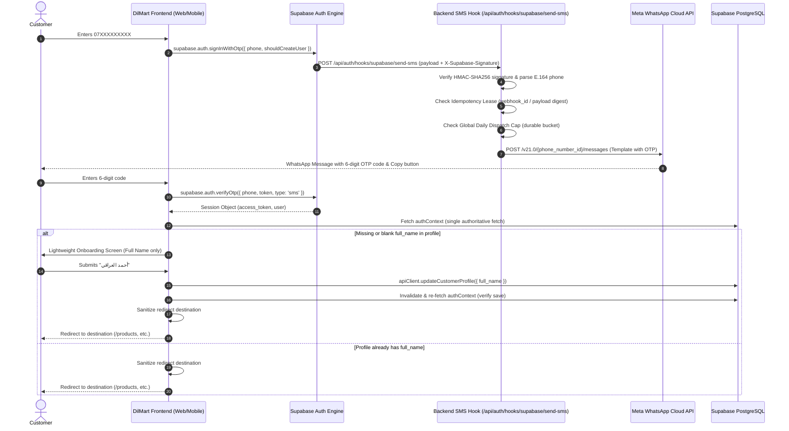

# DILMART — Customer WhatsApp OTP Architecture & Specifications
**Task ID**: `DILMART-CUSTOMER-WHATSAPP-OTP-AUTH-007`  
**Status**: `CODE READY / DARK LAUNCH (FAIL-CLOSED)`

---

## 1. Executive Summary & Core Decisions

DilMart customer authentication is architected to be **phone-first via WhatsApp OTP**:
1. **Primary Experience**: Customer enters an Iraqi mobile number (`07XXXXXXXXX` / `+9647XXXXXXXXX`), receives a 6-digit OTP via WhatsApp, verifies the code, and is authenticated.
2. **Unified Login & Registration**: If `VITE_AUTH_PHONE_REGISTRATION_ENABLED=true`, a single entry screen serves both existing and new users. When a new user verifies OTP, lightweight onboarding asks only for their `full_name` (saved via `apiClient.updateCustomerProfile`). No email, password, or PIN is forced upon them.
3. **Fail-Closed Dark Launch**:
   - Backend `OTP_WHATSAPP_MODE=disabled` by default.
   - Frontend `VITE_AUTH_PHONE_OTP_ENABLED=false`, `VITE_AUTH_PHONE_REGISTRATION_ENABLED=false`, `VITE_AUTH_PHONE_LINKING_ENABLED=false`.
   - In disabled mode, WhatsApp requests fail-closed without sending any external network traffic or SMS charges.
4. **Fallback Authentication**: Legacy email/password authentication remains fully functional and accessible via a subtle secondary link / toggle.
5. **No Mobile Footer Interference**: Auth pages remain isolated shells without rendering `Footer.tsx` or sticky cart bars.

---

## 2. Configuration & Flag Governance: Build-Time vs Runtime

> [!IMPORTANT]
> **Build-Time vs Runtime Boundary**:
> - All `VITE_*` flags are **embedded into JavaScript bundles at frontend build time**. Changing any `VITE_*` variable in `.env` or Render static site settings has **zero effect** on already-built web assets or native Android APK/AAB packages. Any frontend flag update requires a clean build (`npm run build`, `npm run build:mobile`, `npx cap sync android`, and creating a new APK/AAB).
> - Backend `OTP_WHATSAPP_*` and `SUPABASE_AUTH_HOOK_*` variables are **runtime environment variables** read by NestJS on service start. Changing them in the Render backend dashboard takes effect upon redeployment/restart of the backend service without rebuilding frontend packages.

### 2.1 Feature Flags Matrix

| Variable | Environment | Default | Scope | Description |
| :--- | :--- | :--- | :--- | :--- |
| `VITE_AUTH_PHONE_OTP_ENABLED` | Frontend | `false` | Build-time | Activates phone WhatsApp OTP tab / screen |
| `VITE_AUTH_PHONE_REGISTRATION_ENABLED` | Frontend | `false` | Build-time | Unified login/register entry; sets `createUser: true` |
| `VITE_AUTH_PHONE_LINKING_ENABLED` | Frontend | `false` | Build-time | Allows existing email customers to link verified phone |
| `VITE_AUTH_EMAIL_OTP_ENABLED` | Frontend | `false` | Build-time | Email OTP channel |
| `OTP_WHATSAPP_MODE` | Backend | `disabled` | Runtime | Options: `disabled`, `sandbox`, `live` |
| `OTP_WHATSAPP_TEMPLATE_NAME` | Backend | unset | Runtime | Approved template name in Meta Business Manager |
| `OTP_WHATSAPP_TEMPLATE_LANGUAGE` | Backend | unset | Runtime | Approved template language code (e.g. `ar` or `en_US`) |
| `OTP_WHATSAPP_TEMPLATE_TYPE` | Backend | dynamic | Runtime | `AUTH_COPY_CODE`, `AUTH_ONE_TAP`, `TEXT_CUSTOM`, etc. |
| `OTP_WHATSAPP_PHONE_NUMBER_ID` | Backend | unset | Runtime | Meta Graph API Phone Number ID |
| `OTP_WHATSAPP_ACCESS_TOKEN` | Backend | unset | Runtime | Meta System User permanent token |
| `OTP_WHATSAPP_DAILY_GLOBAL_LIMIT` | Backend | `200` | Runtime | Global daily dispatch cap (sandbox requires positive integer) |
| `OTP_WHATSAPP_DAILY_LIMIT_TIMEZONE` | Backend | `Asia/Baghdad` | Runtime | Timezone for daily dispatch bucket reset |
| `SUPABASE_AUTH_HOOK_SECRET` | Backend | unset | Runtime | HMAC-SHA256 signature secret from Supabase Hook |

---

## 3. End-to-End Authentication Journey

---

## 4. Frontend Resilience & Security Controls

### 4.1 Masking for Privacy & Logs
- **Display Masking**: Iraqi numbers are displayed in UI as `+964 7XX *** 1234` (via `maskIraqiPhoneForDisplay`), preserving privacy on screens and recordings.
- **Log Masking**: Sentry and console logs redact identifiers via `maskIdentifierForLogs`, outputting `+964 7XX *** 1234`.

### 4.2 Safe Redirection Algorithm
To prevent Open Redirect and query-truncation bugs:
- Parses target with `new URL(destination, "https://dilmart.invalid")`.
- Guarantees origin equals `https://dilmart.invalid`.
- Rejects protocol-relative URLs (`//evil.com`), backslashes (`\evil.com`), control characters (`\x00-\x1F\x7F`), and encoded separators (`%2f`, `%5c`, `%00`).
- Matches strictly against allowlisted customer routes from `CustomerRoutes.tsx` (`/`, `/products`, `/product/:slug`, `/stores`, `/store/:slug`, `/category/:slug`, `/cart`, `/checkout`, `/thank-you`, `/profile`, `/wishlist`, `/track-order`, `/my-account/*`).
- Rejects empty dynamic paths (`/product/`, `/store/`, `/category/`) and lookalike prefixes (`/productx/123`, `/storefront/test`, `/admin-example`).
- Preserves exact pathname casing, search parameters, and hash fragments (e.g. `/products?category=home#latest`).
- Falls back safely to `/profile`.

### 4.3 Onboarding Integrity & Error Recovery
- Evaluates `authContext.profile?.full_name?.trim()`, properly handling `profile === null`.
- After updating customer profile, invalidates and re-fetches `auth-context` exactly once, verifying that the refreshed profile contains the non-blank name before redirecting.
- If context fetch fails or network glitches occur:
  - Session is **preserved**.
  - User is **not** kicked back to the OTP step.
  - Context error retry button allows immediate re-attempting without re-sending OTP codes.
- Rapid double-clicks on onboarding submission are prevented with an in-flight latch (`onboardingBusy`).

---

## 5. Backend SMS Hook & Meta Provider Architecture

### 5.1 Supabase Send SMS Hook (`/api/auth/hooks/supabase/send-sms`)
- **Signature Verification**: Validates `X-Supabase-Signature` using raw request body buffer and HMAC-SHA256 against `SUPABASE_AUTH_HOOK_SECRET`. Requests lacking a valid signature are rejected with HTTP 401.
- **Idempotency Lease**: Tracks `webhook-id` and payload hash for 10 minutes to prevent duplicate dispatches if Supabase retries hooks.
- **Canary Daily Dispatch Cap**: Limits total dispatches reaching Meta via durable table `whatsapp_otp_daily_dispatches` and atomic RPC `claim_whatsapp_daily_dispatch`, resetting daily at midnight in `Asia/Baghdad`. Sandbox mode fails closed if limit is missing or invalid.
- **Timeouts & Circuit Breaker**: Dispatches to Meta with a 4000ms timeout.
- **Fail-Closed**: If `OTP_WHATSAPP_MODE=disabled`, returns an immediate rejection, preventing unwanted charges.

### 5.2 Meta WhatsApp OTP Provider
- Supports dynamic authentication templates matching the actual approved Meta template:
  - `AUTH_COPY_CODE`: Meta template with `type: "BUTTON", sub_type: "url", index: "0"` or copy-code button.
  - `AUTH_ONE_TAP`: Zero-tap / one-tap autofill.
  - `TEXT_CUSTOM`: Fallback transactional text message.
- Replaces raw errors with classified provider codes (`CONFIG_ERROR`, `PROVIDER_REJECTED`, `TIMEOUT`, `UNKNOWN`).
- Logs mask recipient phone numbers (`+*********4567`). Zero tokens or OTP values appear in logs.
